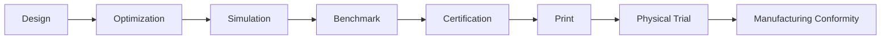
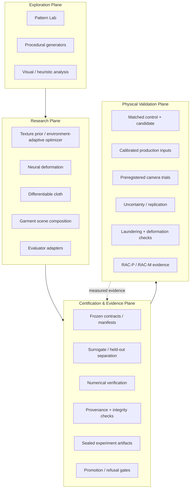
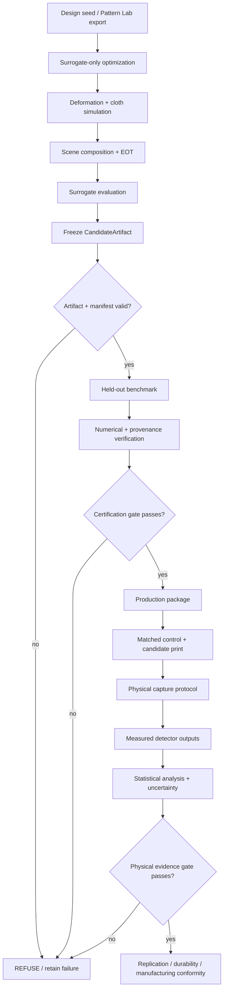

# Ruthless Adversarial Clothing Pipeline

**RAC is an experimental physical-AI robustness platform for designing, simulating, manufacturing, and reproducibly evaluating machine-optimized textiles against computer-vision systems in owned or explicitly authorized lab environments.**

Adversarial clothing is the flagship application. The deeper project is the research and evidence infrastructure required to answer a harder question:

> **Does a physical design remain effective after optimization leaves the screen and encounters deformation, print variation, real scenes, held-out models, manufacturing constraints, and physical testing?**



RAC is deliberately built to preserve negative results, reject invalid evidence, separate exploratory heuristics from measured results, and fail closed when provenance or numerical integrity cannot be established.

**Repository state reviewed:** 2026-09-09  
**Python package version:** `3.1.0`  
**Documentation baseline:** current `main` — see [`docs/PROJECT_PROGRESS.md`](docs/PROJECT_PROGRESS.md) for the authoritative live progress ledger.

## What RAC actually is

RAC is not just a pattern generator and not just a clothing prototype. It is a layered research system spanning candidate creation, physical simulation, evaluation, evidence control, manufacturing preparation, and real-world validation.



For the complete topology, data-flow, evidence-flow, trust-boundary and lifecycle diagrams, see [`docs/DIAGRAMS.md`](docs/DIAGRAMS.md). For implementation-level architecture, see [`docs/ARCHITECTURE.md`](docs/ARCHITECTURE.md).

## Why this project exists

Generating an adversarial-looking image is not the same thing as demonstrating a robust physical effect. RAC therefore treats candidate generation as only the first part of the problem.

The system combines optimization, deformation modeling, differentiable cloth simulation, scene composition, surrogate/held-out evaluation, deterministic replay, provenance controls, sealed artifacts, matched-control production, and physical/manufacturing evidence gates.

The intended research progression is:

1. generate or optimize a candidate using surrogate-only information;
2. preserve the candidate and its provenance as an immutable artifact;
3. evaluate against frozen held-out model sets and transformation protocols;
4. reject invalid, stale, mismatched, non-finite, or unverifiable experimental states;
5. manufacture the candidate and a matched control;
6. run preregistered physical trials across realistic conditions;
7. report uncertainty and retained failures without extrapolating beyond collected evidence.

This architecture is useful beyond clothing alone. The same research system can support authorized physical-AI robustness experiments involving printed surfaces, signage, vehicle graphics, robotic perception targets, warehouse markings, and other camera-visible physical artifacts.

## End-to-end experimental flow



A failure at any gate remains part of the research record; it is not silently rewritten as success.

## RAC certification and evidence layer

Version 3.1 includes an internal fail-closed evidence certification layer under `ruthless_pipeline/certification/`, frozen protocol/model-set contracts, baseline qualification, sealed artifact bundles, physical/manufacturing conformity schemas, and a measured-result import boundary in Pattern Lab. See [`docs/CERTIFICATION_SYSTEM.md`](docs/CERTIFICATION_SYSTEM.md).

Recent hardening adds deterministic integration rehearsal, replay/crash/integrity checks, non-finite-output refusal, candidate/control pairing guards, stale production-mapping detection, source-manifest pinning, baseline preservation, failure injection, and independent numerical-verification utilities.

Real detector weights, calibrated print data, physical trials, and production measurements remain required external evidence. **The software does not manufacture evidence and the repository does not currently support a real-world product-efficacy claim.**

## Current repository state

| Area | Current state | Evidence boundary |
|---|---|---|
| Python research package | Present under `ruthless_pipeline/` | Production-hardened research infrastructure; not a physical-product claim |
| Pattern Lab | Browser design / experiment-management plane | Exploratory output and heuristic analysis are not measured detector evidence |
| Candidate optimization | NAP + environment-adaptive path | Surrogate-only generation; held-out membership must remain excluded |
| Deformation | Differentiable correspondence field + uncertainty | Calibrated physical capture remains external |
| Physics | Differentiable mass-spring baseline | Simulation; not a substitute for physical evidence |
| Scene composition | Differentiable garment-mask compositor | Bridges texture outputs into evaluator-ready scenes |
| Benchmarking | Surrogate/held-out split + transform sweeps | Frozen evaluator/model manifests required for measured claims |
| Certification layer | Frozen contracts, provenance, evidence labels, sealed artifacts | Promotion/refusal gates protect evidence quality |
| Integration rehearsal | Deterministic synthetic end-to-end composition | Verifies orchestration, replay and failure behavior |
| Numerical verification | Independent reference checks | Reproducibility, finiteness, objective, seed and hash validation |
| Production Alpha | Matched control/candidate workflow | Physical-order execution still required |
| Physical garment validation | Not yet closed | No product-efficacy claim is supported yet |

## Current research status

- the design factory, certification architecture, statistics layer, Research OS, integration rehearsal and verification infrastructure are substantially implemented;
- D2-0003 remains a retained FAIL / RAC-D0 negative result;
- D2-0004 is a retained FAIL / RAC-D0 negative result with sealed release `releases/RAC-EXP-2026-001/`;
- fail-closed production guards now include candidate/control pairing and stale-mapping source pinning;
- Production Alpha remains dependent on the matched control/candidate physical-order path and provider-specific production inputs;
- RAC-P and RAC-M remain open because real physical/manufacturing evidence has not yet been collected.

See [`docs/PROJECT_PROGRESS.md`](docs/PROJECT_PROGRESS.md) for the authoritative live state.

## Pattern Lab boundary

The browser Pattern Lab is a **design and experiment-management prototype**, not a detector benchmark.

Use the web UI for visual exploration, parameter capture, pattern history, exports, and experiment orchestration. Measured detector evidence belongs in the Python benchmark/certification path with frozen evaluator/model manifests and provenance.

## Research-engineering principles

- **Negative results are results.** Failed generations are retained rather than rewritten as successes.
- **Exploration is not evidence.** Browser heuristics and surrogate outputs cannot silently become measured claims.
- **Held-out means held-out.** Candidate generation records surrogate membership and keeps certification models outside that boundary.
- **Invalid states fail closed.** Missing hashes, stale manifests, mismatched control/candidate pairs, corrupt checkpoints, and non-finite objectives produce explicit refusals.
- **Reproducibility is part of the result.** Seeds, manifests, code hashes, model references, transform settings and artifact identities are evidence inputs.
- **Physical claims require physical measurements.** Simulation can justify what to test; it cannot substitute for the test.

## Documentation map

Start here:

- [`docs/DIAGRAMS.md`](docs/DIAGRAMS.md) — topology, architecture, flowcharts, trust boundaries, evidence flow and lifecycle diagrams.
- [`docs/ARCHITECTURE.md`](docs/ARCHITECTURE.md) — implementation architecture and plane boundaries.
- [`docs/CERTIFICATION_SYSTEM.md`](docs/CERTIFICATION_SYSTEM.md) — evidence ladder and fail-closed promotion/refusal system.
- [`docs/END_TO_END_RESEARCH_SOP.md`](docs/END_TO_END_RESEARCH_SOP.md) — design → digital validation → print → physical testing workflow.
- [`docs/PROJECT_PROGRESS.md`](docs/PROJECT_PROGRESS.md) — authoritative live project ledger.
- [`docs/papers/README.md`](docs/papers/README.md) — research manuscript workspace.

## Quick start

```bash
python -m pip install -e .
pytest
python -m examples.smoke_test
```

Original-style entrypoints remain available:

```bash
python 01_enhanced_black_box_nap.py
python 02_neural_deformation_module.py
python 03_differentiable_physics_pipeline.py
python 04_comparative_benchmark.py
```

## Evidence labels

Every quantitative result in research notes, dashboards, product documents or manuscripts should carry one of these labels:

1. **Published observation** — measured by an external source; citation required.
2. **External result — replication needed** — relevant published result not yet reproduced internally.
3. **Internally measured** — generated by a frozen, versioned internal protocol with retained artifacts.
4. **Target** — desired future result; never presented as current performance.
5. **Scenario assumption** — planning input, not a forecast presented as fact.
6. **Speculative/open** — hypothesis or research question.

## Current technical gates

Before any physical product-efficacy claim:

1. keep CI green and preserve fail-closed certification gates;
2. freeze exact model/evaluator versions, preprocessing, thresholds, seeds and surrogate/held-out splits;
3. connect real detector adapters under authorized test conditions;
4. capture calibrated garment-deformation data rather than relying only on synthetic fixtures;
5. calibrate digital-to-print color using measured printer/fabric profiles;
6. manufacture a candidate and matched control from frozen artifacts;
7. run preregistered physical trials across distance, angle, pose, lighting, compression, garment size and laundering state;
8. report uncertainty/confidence intervals and held-out results without extrapolating to untested systems;
9. reproduce meaningful results with an independently manufactured second garment before treating an effect as robust.

## Responsible-use boundary

The generic evaluator and black-box interfaces are for systems you own or have explicit authorization to evaluate. The repository intentionally contains no vendor-specific surveillance integrations.

Generated outputs, model weights, datasets, environment files and credentials should remain outside source control. See `RESPONSIBLE_USE.md`, `SECURITY.md`, and `PRODUCTION_READINESS.md`.

## License

The current `LICENSE` is all-rights-reserved for internal/business development. It is intentionally not described as MIT because an MIT license cannot simultaneously impose an “authorized use only” restriction.
