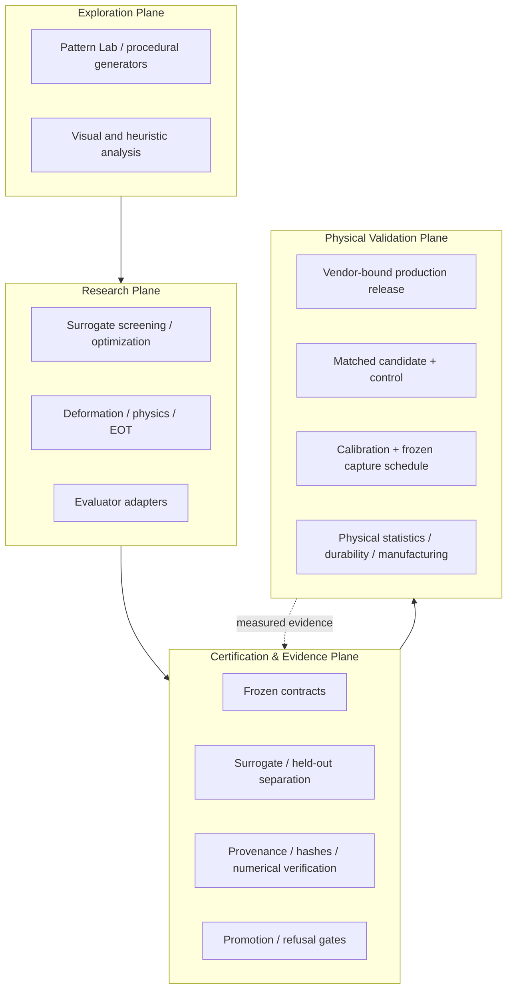

# Ruthless Adversarial Clothing Pipeline

**RAC is an experimental physical-AI robustness platform for designing, evaluating, manufacturing, and reproducibly testing machine-optimized textiles against computer-vision systems in owned or explicitly authorized environments.**

Adversarial clothing is the flagship application. The broader project is the research, production, governance, and evidence infrastructure required to answer a harder question:

> **Does a design that looks promising digitally survive frozen evaluation rules, manufacturing constraints, deformation, real scenes, matched controls, and physical testing?**


RAC is deliberately fail-closed: negative results are retained, held-out boundaries are enforced, frozen scientific surfaces are not silently rewritten, and software completion is never treated as physical-efficacy evidence.

**Repository state reviewed:** 2026-09-11  
**Scientific/production baseline reviewed:** `8114e2189a255bed3d4c07708d7380c7ade2aefc` (subsequent commits in this pass are documentation-only)  
**Python package version:** `3.1.0`

## Current state

| Surface | State |
| --- | --- |
| Engineering Barriers 0–3 | **Closed for declared scope** |
| Core research / evidence infrastructure | **Advanced / integrated** |
| Pattern Genome v1 | **Frozen** |
| D2-0003 | **Retained negative / RAC-D0**; Alpha-001 lineage remains bound here |
| D2-0004 | **Closed negative / RAC-D0** |
| D2-0005 | **Preregistered / not armed** |
| D2-0007 | **Closed at Stage 1 — SCREENED_OUT_H0**; 64/64 compositions evaluated, 0 survivors, no held-out access, no anchor engineering, no optimization, no candidate freeze, no Alpha-002 |
| Alpha-001 sealed source | **Recovered and hash-verified** from the original successful GitHub Actions artifact |
| P1 production software | **Ready for live vendor intake and exact artwork build** |
| P1 no-spend readiness | **Software gate implemented and fail-closed** |
| Authoritative P1 schedule | **144 frozen trials**; older 108-row planning material is historical only |
| Physical P1 evidence | **Open — not executed** |
| Product physical-efficacy claim | **Not supported** |

The canonical program-level state is [`docs/CURRENT_PROGRAM_STATE.md`](docs/CURRENT_PROGRAM_STATE.md). Detailed current workstream context is in [`docs/PROJECT_PROGRESS_CURRENT.md`](docs/PROJECT_PROGRESS_CURRENT.md). The older [`docs/PROJECT_PROGRESS.md`](docs/PROJECT_PROGRESS.md) is a historical September 8 snapshot, not the current authority.

## What RAC actually is

RAC is not just a pattern generator. It is a four-plane research and production system:



For the implementation topology, see [`docs/ARCHITECTURE.md`](docs/ARCHITECTURE.md). For visual system and evidence-flow diagrams, see [`docs/DIAGRAMS.md`](docs/DIAGRAMS.md).

## Scientific lineage status

### D2-0003 / Alpha-001

D2-0003 is a retained digital negative result, but it produced the immutable candidate lineage used by `RAC-PRINT-ALPHA-001`. Alpha-001 has **not** been rebound to a later generation.

The original sealed `print-test-kit.zip` was recovered from historical GitHub Actions run `34078238095`. Recovery provenance is committed at [`evidence/p1/alpha001-source-recovery.json`](evidence/p1/alpha001-source-recovery.json). The recovery receipt binds:

- sealed kit SHA-256: `b22b022fd98bc8587251099464010dbc3288f8da70756e183f8e366be06f0548`;
- frozen 4096×4096 pattern SHA-256: `b07b617fe6dbe178330fff2d9f65c2b720948b641e2bd4865e43ebd62c261546`;
- no regeneration or retuning;
- no new held-out access;
- no physical-efficacy claim.

### D2-0007

D2-0007 was a prospective motif-screening lineage intended to earn more expensive anchor/optimization work only if a preregistered Stage-1 screen passed.

It did **not** pass. All 64 preregistered screening compositions were evaluated on `PERSON-SUR-v3`; no motif met the survivor rule. The generation therefore closed as `SCREENED_OUT_H0`. Per the preregistration, no body/garment anchor adapter was built, optimization did not open, no held-out data was accessed, no candidate was frozen, and no Alpha-002/P1B lineage was created. See [`evidence/d2-0007/stage1-screening-closure.json`](evidence/d2-0007/stage1-screening-closure.json).

## Production Alpha / physical P1

The current production target is `RAC-PRINT-ALPHA-001` using the exact recovered D2-0003 artwork source. The canonical real-production entry point is:

```bash
python tools/p1_production_release.py intake --fetch --size M --output-dir production_alpha/vendor_intake
python tools/p1_production_release.py build \
  --intake production_alpha/vendor_intake/vendor-intake.json \
  --print-test-kit /secure/path/print-test-kit.zip \
  --recorded-by '<operator>'
```

The release wrapper validates live Printful product identity, required placements, raw vendor-response integrity, deterministic vendor archives, and the frozen Alpha-001 kit/pattern hashes. It does **not** place an order or authorize spend.

After review, the generated UA values pass through the existing binder and readiness gates:

```bash
python tools/p1_bind_ua_values.py --values production_alpha/vendor_intake/ua-values.generated.json --check-only
python tools/p1_bind_ua_values.py --values production_alpha/vendor_intake/ua-values.generated.json
python tools/p1_no_spend_readiness_gate.py
```

The exact operator flow is documented in [`docs/P1_PRODUCTION_RELEASE_GATE.md`](docs/P1_PRODUCTION_RELEASE_GATE.md), [`docs/P1_PRODUCTION_LAUNCH.md`](docs/P1_PRODUCTION_LAUNCH.md), and [`docs/USER_ACTION_NEXT_STEPS.md`](docs/USER_ACTION_NEXT_STEPS.md).

### P1 execution authority

Do **not** execute the older 108-row planning sheet. The current P1 authority is:

- [`physical/p1/P1_CAPTURE_SCHEDULE.json`](physical/p1/P1_CAPTURE_SCHEDULE.json) — 144 frozen trials;
- [`physical/p1/PAIRING_RANDOMIZATION_CONTRACT.json`](physical/p1/PAIRING_RANDOMIZATION_CONTRACT.json);
- [`physical/p1/P1_OPERATOR_RUNBOOK.md`](physical/p1/P1_OPERATOR_RUNBOOK.md);
- [`physical/p1/P1_READINESS_FREEZE.json`](physical/p1/P1_READINESS_FREEZE.json);
- [`tools/p1_no_spend_readiness_gate.py`](tools/p1_no_spend_readiness_gate.py).

Physical efficacy remains unestablished until admissible matched physical captures are actually collected, ingested, sealed, and analyzed under those frozen rules.

## Research-engineering principles

- **Negative results are results.** D2-0003, D2-0004, and the D2-0007 screened-out null remain part of the research record.
- **Exploration is not evidence.** Browser heuristics and style scores cannot silently become measured efficacy claims.
- **Held-out means held-out.** Candidate generation and screening cannot use certification feedback unless a new governed experiment explicitly permits it.
- **Invalid states fail closed.** Missing hashes, stale manifests, mismatched pairs, unexpected vendor placements, tampered receipts, and non-finite outputs produce refusal rather than silent continuation.
- **Reproducibility is part of the result.** Seeds, source commits, model identities, thresholds, vendor bytes, artwork bytes, and physical artifact identities are evidence inputs.
- **Physical claims require physical measurements.** Simulation and digital testing determine what is worth testing; they do not replace P1.

## Documentation map

Start with these files:

- [`docs/CURRENT_PROGRAM_STATE.md`](docs/CURRENT_PROGRAM_STATE.md) — canonical current program status.
- [`docs/PROJECT_PROGRESS_CURRENT.md`](docs/PROJECT_PROGRESS_CURRENT.md) — detailed current workstream ledger.
- [`docs/ARCHITECTURE.md`](docs/ARCHITECTURE.md) — current four-plane architecture and scientific boundaries.
- [`docs/DIAGRAMS.md`](docs/DIAGRAMS.md) — topology and evidence-flow diagrams.
- [`docs/CERTIFICATION_SYSTEM.md`](docs/CERTIFICATION_SYSTEM.md) — evidence ladder and fail-closed certification model.
- [`docs/P1_PRODUCTION_RELEASE_GATE.md`](docs/P1_PRODUCTION_RELEASE_GATE.md) — canonical real-production release entry point.
- [`docs/USER_ACTION_NEXT_STEPS.md`](docs/USER_ACTION_NEXT_STEPS.md) — operator path from current state to admissible P1 evidence.
- [`physical/p1/P1_OPERATOR_RUNBOOK.md`](physical/p1/P1_OPERATOR_RUNBOOK.md) — authoritative physical P1 execution procedure.

Historical preregistrations, closure notes, audit reports, and older planning docs are retained as provenance. They do not outrank frozen contracts or the canonical current-state navigation layer.

## Quick start

```bash
python -m pip install -e .
pytest
python -m examples.smoke_test
```

Original-style entrypoints remain available:

```bash
python 01_enhanced_black_box_nap.py
python 02_neural_deformation_module.py
python 03_differentiable_physics_pipeline.py
python 04_comparative_benchmark.py
```

## Evidence labels

Quantitative statements should remain explicitly classified as one of: **Published observation**, **External result — replication needed**, **Internally measured**, **Target**, **Scenario assumption**, or **Speculative/open**.

## Responsible-use boundary

Evaluator and black-box interfaces are intended for systems you own or have explicit authorization to evaluate. Generated outputs, model weights, datasets, environment files, credentials, and vendor tokens should remain outside source control unless a governed artifact explicitly requires a non-secret hash or receipt.

See [`RESPONSIBLE_USE.md`](RESPONSIBLE_USE.md), [`SECURITY.md`](SECURITY.md), and [`PRODUCTION_READINESS.md`](PRODUCTION_READINESS.md).

## License

The current `LICENSE` is all-rights-reserved for internal/business development. It is intentionally not described as MIT because an MIT license cannot simultaneously impose an authorized-use-only restriction.
