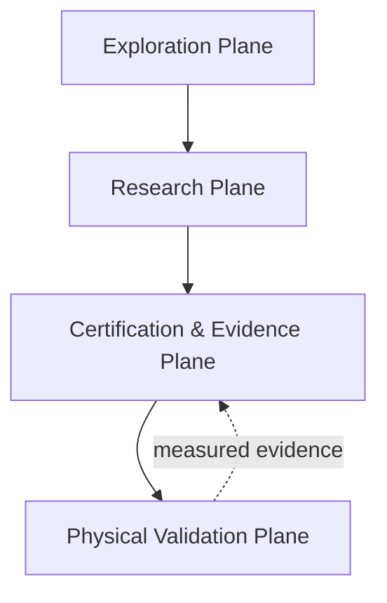
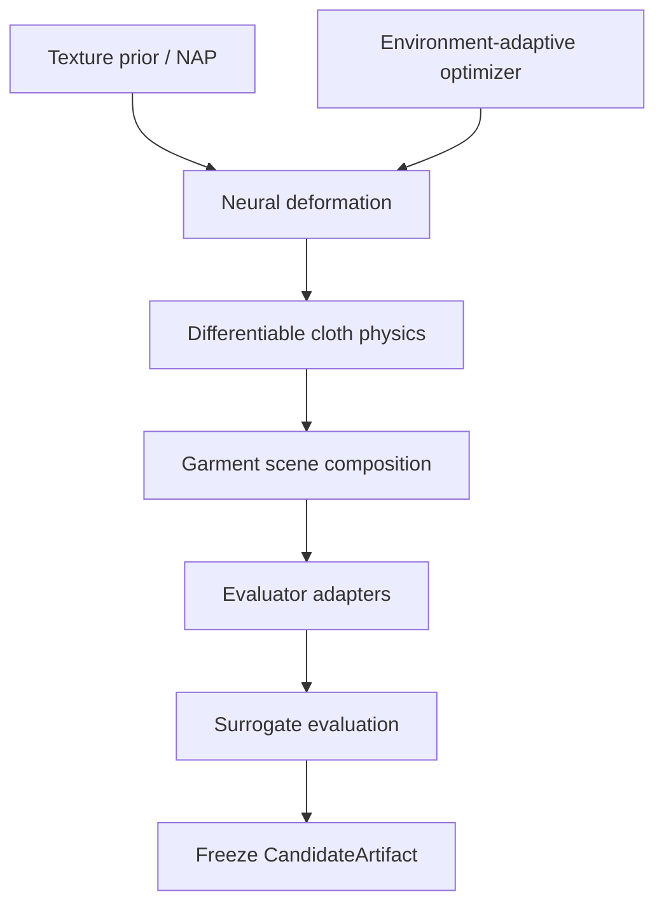
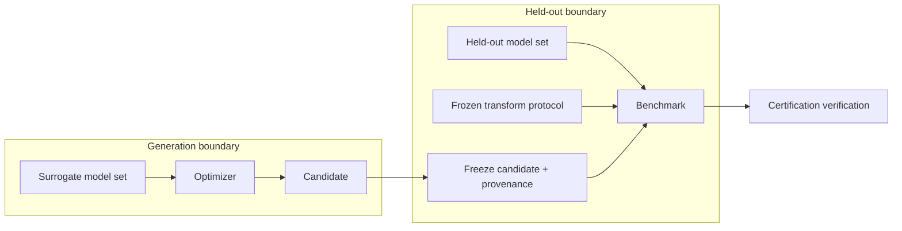
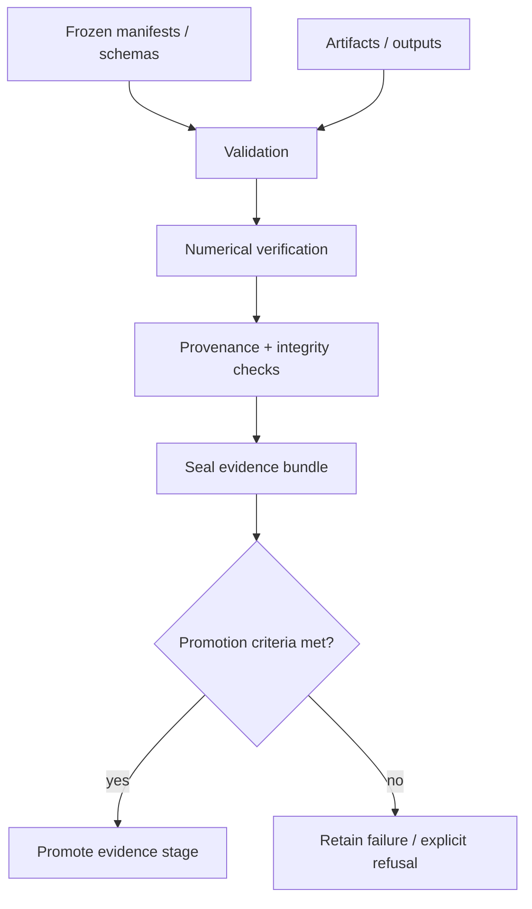
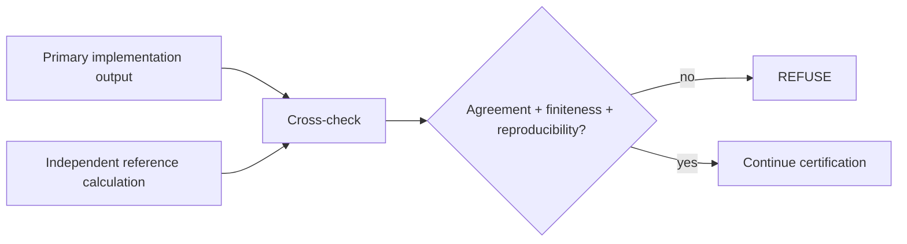
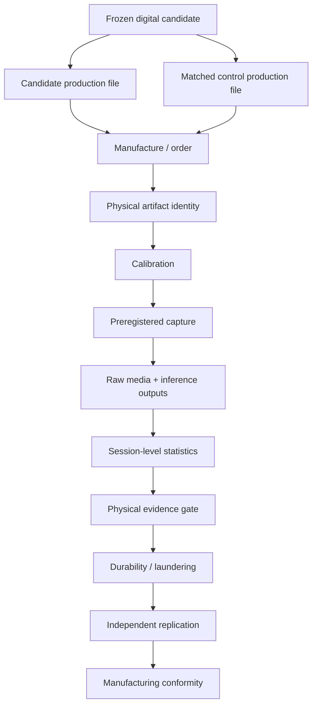

# RAC Architecture

**Reviewed against repository state:** 2026-09-09 (`main`)  
**Python package version:** `3.1.0`

RAC is organized as a **four-plane physical-AI research architecture** with explicit trust and evidence boundaries:

1. **Exploration Plane** — human-facing candidate exploration and configuration.
2. **Research Plane** — optimization, deformation, physical simulation, scene composition and evaluator interfaces.
3. **Certification & Evidence Plane** — frozen contracts, held-out boundaries, numerical verification, provenance, sealing and promotion/refusal logic.
4. **Physical Validation Plane** — matched manufacturing, calibration, capture, measured inference, statistics, replication and manufacturing conformity.

A concise visual reference for all major flows lives in [`DIAGRAMS.md`](DIAGRAMS.md).

## 1. Executive architecture



The central rule is simple: **software capability does not automatically become evidence, and digital evidence does not automatically become physical evidence.**

## 2. Exploration Plane — Pattern Lab

```text
index.html
   |
   +--> styles.css
   +--> core.js
   |      +--> seeded procedural generators
   |      +--> palette/parameter controls
   |      +--> pose/fabric/warp/lighting simulation controls
   |
   +--> analysis.js
          +--> frequency/color visualizations
          +--> heuristic displays
          +--> gallery/history
          +--> PNG/JSON export
```

The Pattern Lab is a design and experiment-management surface. Its responsibilities are:

- visual exploration;
- deterministic/procedural candidate generation;
- parameter capture;
- history/gallery management;
- export of artwork/configuration artifacts;
- display of clearly labeled heuristic or imported measured results.

### Evidence boundary

Pattern Lab output is not automatically detector evidence. Browser heuristics may guide exploration but cannot be promoted into internally measured efficacy claims. Measured detector outputs must originate from the research/benchmark path and retain their provenance.

## 3. Research Plane



### Major components

| Stage | Repository component | Responsibility | Evidence status |
|---|---|---|---|
| Pattern prior / optimization | `ruthless_pipeline/nap.py` and related optimization modules | generate or optimize candidate texture structure | candidate-generation evidence only |
| Environment adaptation | optimization modules documented in `CAPGEN_INTEGRATION.md` | palette extraction and environment-constrained allocation | surrogate-side generation only |
| Deformation | `ruthless_pipeline/deformation.py` | differentiable coordinate deformation + uncertainty | simulation until calibrated against physical capture |
| Physics | `ruthless_pipeline/physics.py` | differentiable mass-spring cloth baseline | simulation; not physical validation |
| Scene composition | `ruthless_pipeline/scene.py` | place garment/pattern into evaluator-ready scenes | digital evaluation input |
| Evaluator adapters | `ruthless_pipeline/evaluators.py` | caller-supplied model interface | measured only under frozen model/protocol manifests |
| Benchmark | `ruthless_pipeline/benchmark.py` | transform sweeps, surrogate/held-out comparison, reports | digital measured evidence when protocol requirements are met |

## 4. Surrogate / held-out trust boundary



The held-out model set must not participate in candidate optimization. Once held-out results are visible, the evaluated candidate remains immutable. A later research generation may use lessons learned, but that is a new experiment with a new identity.

## 5. Certification & Evidence Plane

This plane exists to answer not only **what result was produced**, but **whether that result is admissible under the declared experiment contract**.



Current certification responsibilities include:

- schema validation;
- frozen protocol and model-set contracts;
- baseline qualification and preservation;
- surrogate/held-out membership control;
- deterministic replay and seed reproducibility;
- non-finite output rejection;
- objective and transformation reference checks;
- code/artifact/checkpoint hashing;
- candidate/control pairing validation;
- stale source-mapping detection;
- failure injection and fail-closed behavior;
- sealed release composition;
- evidence labels and promotion/refusal gates.

A failure here is not an implementation inconvenience to be bypassed. It is a refusal to treat an invalid state as evidence.

## 6. Numerical verification architecture

The independent verification harness is intentionally separated from the primary implementation where possible.



Checks include deterministic reruns, finite-value rejection, seed reproducibility, objective decomposition, Pareto reference logic, CVaR/mean reference calculations, transformation-seed reproduction and hash/checkpoint integrity.

## 7. Physical Validation Plane



This plane closes the digital-to-physical gap. It contains evidence that cannot be fabricated by software alone: provider output, physical artifact identity, color/geometry calibration, actual camera capture, matched-control behavior, session-level variation, laundering and replication.

## 8. Evidence ladder

The architecture should be understood as an evidence ladder rather than a feature checklist.

```text
Exploratory design
  -> Candidate artifact
  -> Frozen candidate + provenance
  -> Digital held-out evidence (D2)
  -> Production Alpha artifact pair
  -> Physical evidence (P1)
  -> Replication / durability
  -> Manufacturing evidence (M)
  -> bounded product claim
```

At every transition the system may retain a FAIL or refuse promotion. A failed generation remains valuable research evidence when its protocol and artifacts are valid.

## 9. Data / provenance topology

Every quantitative claim should be traceable backward through the following chain:

```text
claim
  -> sealed release
  -> aggregate metric
  -> raw outputs
  -> run manifest
  -> transform / threshold / seed configuration
  -> model manifest
  -> candidate artifact hash
  -> source commit
```

Physical claims add:

```text
physical claim
  -> capture session
  -> raw camera media
  -> artifact ID
  -> production mapping
  -> calibration artifacts
  -> matched candidate/control identities
```

## 10. Integration rehearsal

The deterministic synthetic integration coordinator exists to verify that the system composes correctly even when real external evidence is unavailable. It exercises end-to-end orchestration, replay, crash handling, integrity behavior and promotion refusal.

Synthetic rehearsal proves software behavior. It does **not** prove adversarial efficacy or physical performance.

## 11. External dependencies and non-repository evidence

The repository intentionally does not bundle every external artifact needed for a real experiment. Depending on the protocol, external inputs may include:

- approved detector/model weights;
- calibrated printer/fabric profiles;
- production-provider templates and identifiers;
- manufactured garments;
- camera devices and calibration targets;
- raw capture media;
- large generated artifacts or datasets;
- protected credentials or environment configuration.

These should be bound into experiments through explicit manifests and hashes rather than silently substituted.

## 12. Design rules

- **No raw-texture efficacy claims.** Evaluate composed scenes or physically meaningful renderings.
- **No hidden backends.** Diffusion, CLIP, detector and high-fidelity physics backends must be explicitly selected and fail loudly when unavailable.
- **Reproducible provenance.** Record model identifiers/versions, seeds, transforms, thresholds, calibration data, test splits, code and artifact hashes.
- **Held-out evaluation.** Optimization/surrogate models must remain separate from held-out reporting models.
- **Physical evidence boundary.** Digital and simulated results are not physical product-validation evidence.
- **UI evidence boundary.** Browser heuristic/demo scores are not benchmark results.
- **Fail closed.** Invalid schemas, stale mappings, mismatched pairs, corrupt checkpoints and non-finite numerical outputs must not be silently tolerated.
- **Retain negative results.** Valid experiments that fail performance gates remain part of the scientific record.
- **Authorized testing only.** External black-box interfaces are limited to systems owned by or explicitly authorized for the operator.

## 13. Reading the architecture with project status

Architecture describes what components and boundaries exist. It must not be used as a substitute for live readiness.

For current implementation and experimental state:

- `PROJECT_PROGRESS.md` — authoritative ledger;
- `CERTIFICATION_SYSTEM.md` — certification transitions;
- `DIAGRAMS.md` — visual map;
- `END_TO_END_RESEARCH_SOP.md` — operational procedure;
- `papers/` — research questions, methods and pending-result manuscripts.
