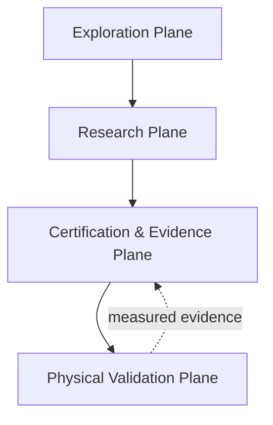
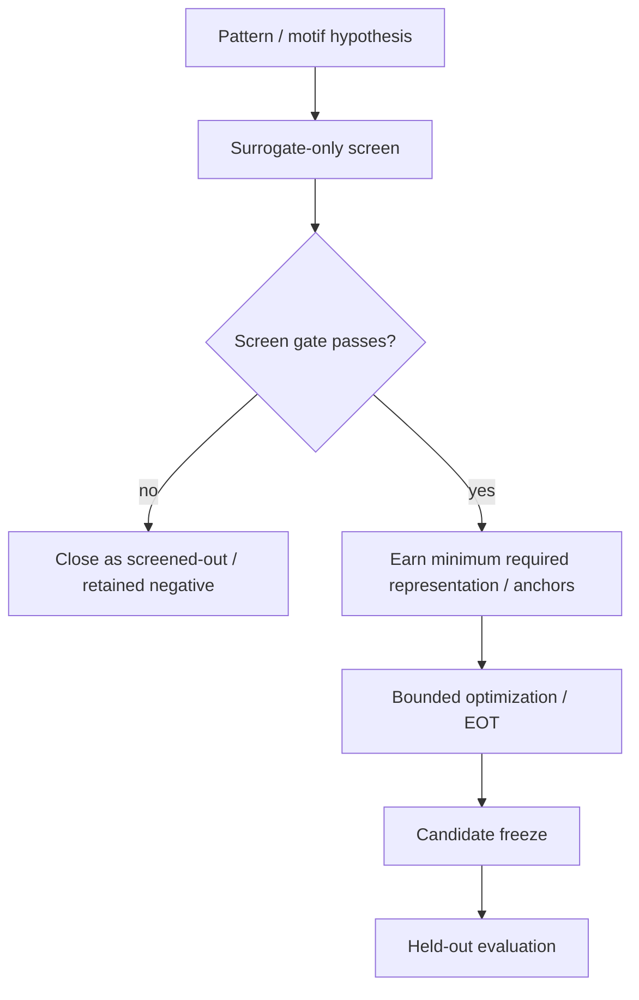
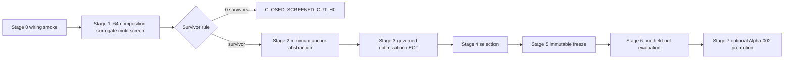
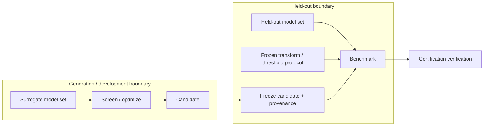
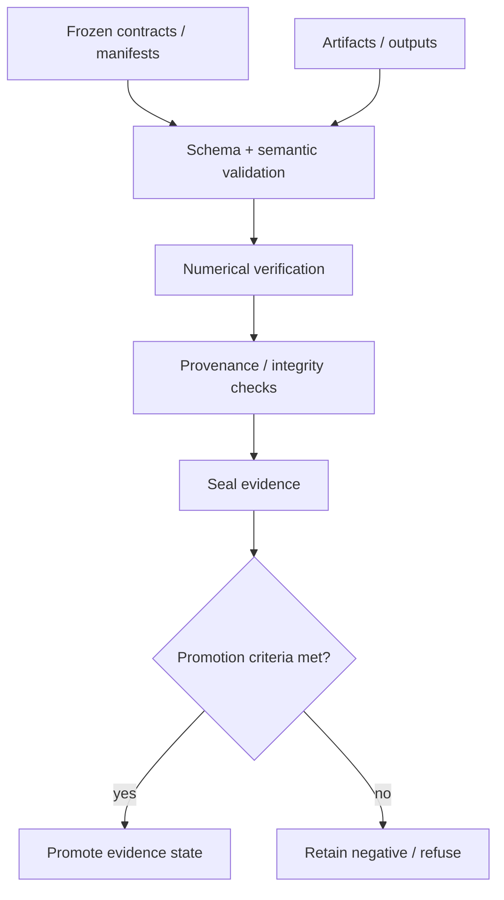
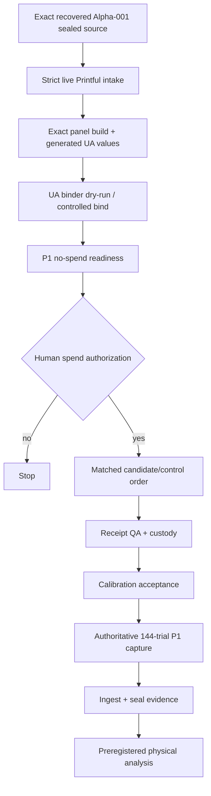

# RAC Architecture

**Reviewed against repository state:** 2026-09-11 (`main`)  
**Python package version:** `3.1.0`

RAC is a **four-plane physical-AI research architecture** with explicit evidence and trust boundaries:

1. **Exploration Plane** — human-facing design exploration and configuration.
2. **Research Plane** — candidate screening/optimization, deformation, simulation, EOT, and evaluator interfaces.
3. **Certification & Evidence Plane** — frozen contracts, model-set boundaries, numerical/provenance checks, sealing, and promotion/refusal logic.
4. **Physical Validation Plane** — live vendor binding, exact production release, matched manufacturing, calibration, capture, statistics, durability, and manufacturing conformity.

The central invariant is: **software capability is not automatically evidence, digital evidence is not physical evidence, and a failed gate is a valid research outcome.**

## 1. Executive architecture



## 2. Exploration Plane

The browser-facing Pattern Lab / Product Studio surface supports:

- deterministic procedural generation;
- visual exploration;
- parameter and seed capture;
- product-oriented previews;
- history/gallery workflows;
- export of artwork and candidate configuration;
- clearly labeled heuristic displays.

### Evidence boundary

Browser heuristics, style scores, and visual similarity are exploratory signals. They cannot silently become internally measured detector evidence or physical-efficacy claims.

## 3. Research Plane



Major implementation families include:

| Stage | Representative component | Responsibility | Evidence boundary |
| --- | --- | --- | --- |
| Pattern generation | browser generators and `ruthless_pipeline/patterns/` | deterministic candidate/motif construction | exploratory or screening evidence until governed |
| NAP / optimization | `ruthless_pipeline/nap.py` and optimization modules | bounded candidate search | surrogate-side only unless a protocol states otherwise |
| Deformation | `ruthless_pipeline/deformation.py` | differentiable correspondence / warp | simulation until physically calibrated |
| Physics | `ruthless_pipeline/physics.py` | cloth baseline | simulation, not physical validation |
| Scene composition | `ruthless_pipeline/scene.py` | compose garment/pattern into evaluator-ready scenes | digital evaluation input |
| Evaluators | `ruthless_pipeline/evaluators.py` | model adapters | measured only under pinned evaluator/model/protocol state |
| Benchmarking | benchmark modules / scripts | transform sweeps and evidence extraction | governed by frozen generation contracts |

## 4. Prospective generation gating

RAC now explicitly supports **earned complexity**: expensive representation, optimization, and held-out evaluation need not exist for a hypothesis that fails an earlier preregistered screen.

D2-0007 is the current concrete example:



Observed D2-0007 outcome: **zero survivors**. Therefore the architecture correctly stopped before anchors, optimization, freeze, held-out access, or Alpha-002.

This pattern prevents infrastructure existence from being mistaken for scientific authorization.

## 5. Surrogate / held-out trust boundary



Held-out models cannot participate in candidate selection unless a new experiment explicitly defines that use. Once held-out results are observed, the evaluated candidate remains immutable.

## 6. Certification & Evidence Plane



Current responsibilities include:

- schema and semantic validation;
- frozen protocol/model-set contracts;
- surrogate/held-out membership control;
- deterministic replay and seed checks;
- non-finite-output rejection;
- code/artifact/checkpoint hashing;
- candidate/control pairing checks;
- stale mapping/source detection;
- immutable negative-result retention;
- release sealing;
- evidence labels and promotion/refusal gates.

A failure here is not bypassed to preserve momentum. It is the system refusing invalid evidence.

## 7. Physical Validation Plane

The current physical path is more specific than the older generic production compiler:



The canonical production software entry point is `tools/p1_production_release.py`. It verifies live vendor identity/placements and vendor evidence integrity, then requires the exact frozen Alpha-001 source hash before producing exact-size panel artwork.

It deliberately stops before procurement.

## 8. Alpha-001 production identity

`RAC-PRINT-ALPHA-001` remains bound to `RAC-PER-D2-0003`.

The exact source is recoverable through the provenance receipt at `evidence/p1/alpha001-source-recovery.json`:

- sealed kit SHA-256: `b22b022fd98bc8587251099464010dbc3288f8da70756e183f8e366be06f0548`;
- frozen pattern SHA-256: `b07b617fe6dbe178330fff2d9f65c2b720948b641e2bd4865e43ebd62c261546`;
- no regeneration or retuning;
- no Alpha-001 rebinding.

This is a provenance/production identity statement, not a physical-efficacy statement.

## 9. P1 execution authority

The current physical P1 authority is:

```text
physical/p1/P1_OPERATOR_RUNBOOK.md
physical/p1/P1_CAPTURE_SCHEDULE.json        # 144 frozen trials
physical/p1/PAIRING_RANDOMIZATION_CONTRACT.json
physical/p1/P1_READINESS_FREEZE.json
tools/p1_no_spend_readiness_gate.py
tools/p1_bind_ua_values.py
```

Earlier 108-row Print Alpha planning material is historical and not execution authority.

## 10. Evidence ladder

```text
Exploratory design
  -> governed screening / candidate artifact
  -> immutable candidate + provenance
  -> digital held-out evidence when authorized
  -> exact production release
  -> matched physical candidate/control
  -> P1 physical evidence
  -> replication / durability
  -> manufacturing conformity
  -> bounded product claim
```

At every transition, RAC may retain a negative result or refuse promotion.

## 11. Data and provenance topology

Digital claim path:

```text
claim
  -> sealed release / closure artifact
  -> aggregate metric
  -> raw outputs
  -> run manifest
  -> transforms / thresholds / seeds
  -> model-set contract
  -> candidate hash
  -> source commit
```

Physical claim path adds:

```text
physical claim
  -> sealed physical evidence
  -> capture session
  -> raw media
  -> physical artifact IDs
  -> receipt QA / custody
  -> production mapping + uploaded artwork hashes
  -> live vendor source bytes / archive hashes
  -> exact frozen Alpha source
  -> calibration artifact
```

## 12. Documentation authority

- `CURRENT_PROGRAM_STATE.md` — canonical current program navigation.
- `PROJECT_PROGRESS_CURRENT.md` — detailed current progress.
- `DIAGRAMS.md` — explanatory visual topology.
- `P1_PRODUCTION_RELEASE_GATE.md` — canonical production software entry point.
- `physical/p1/P1_OPERATOR_RUNBOOK.md` — physical execution authority.

Historical preregistrations, closure artifacts, audits, and handoffs remain immutable provenance and outrank explanatory summaries for their own experiment/gate.
