# RAC System Diagrams

**Purpose:** provide a visual map of the Ruthless Adversarial Clothing (RAC) research platform without overstating software capability as physical efficacy.

These diagrams describe the implemented and planned system boundaries. A rendered diagram may describe a pathway that crosses an open experimental gate; consult `PROJECT_PROGRESS.md` for the authoritative live state.

## 1. Executive system topology

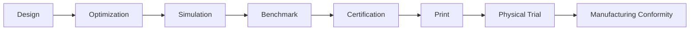

The key idea is that candidate generation is upstream of evidence. No design becomes a product claim merely because it optimized well digitally.

## 2. Four-plane architecture

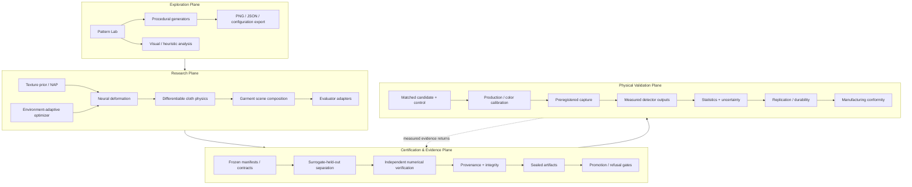

## 3. Candidate-generation topology

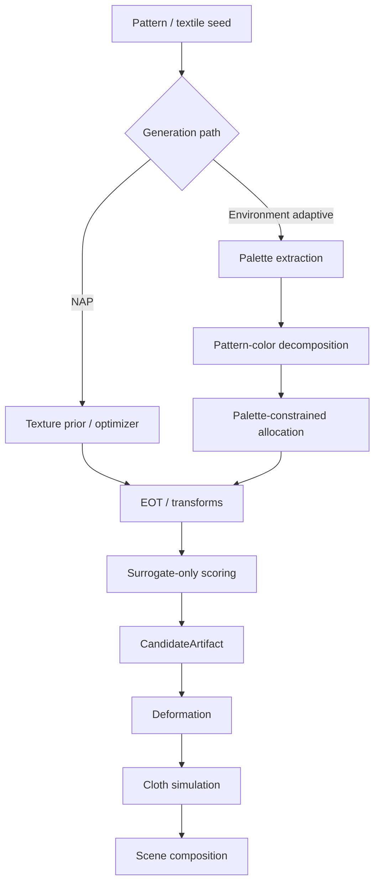

Held-out certification models do not belong in the generation loop.

## 4. Evaluation and trust boundary

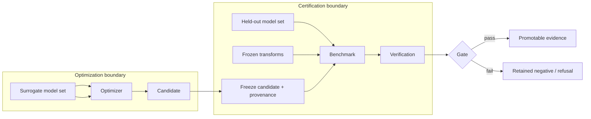

The candidate must be frozen before held-out evaluation. Held-out results may inform a later generation, but not retroactively modify the candidate whose transfer they measure.

## 5. Evidence lifecycle

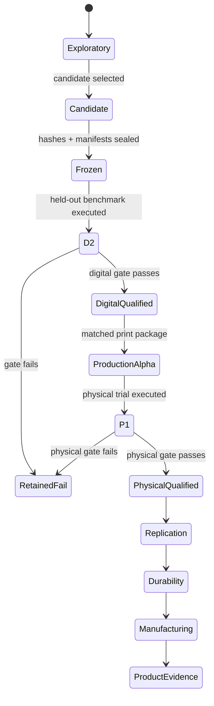

Not every generation should reach the final state. Retained failure is a valid terminal research outcome.

## 6. Fail-closed certification flow

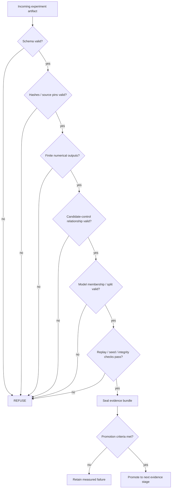

## 7. Digital-to-physical translation flow

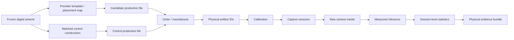

Candidate and control identities must remain distinct and traceable through the entire chain.

## 8. Data and provenance topology

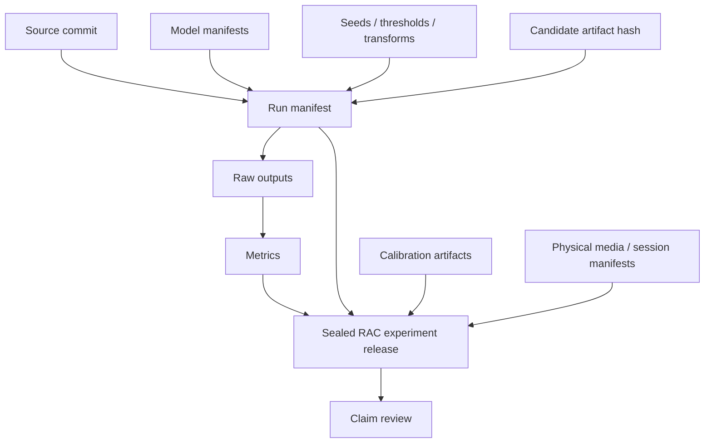

A quantitative claim should be traceable backward from the report to the release, raw outputs, run manifest, candidate identity, model manifest, and source commit.

## 9. Pattern Lab versus measured evidence

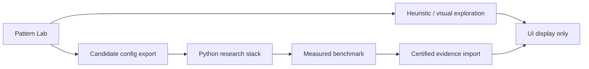

The UI may display both heuristic and measured information, but the provenance and evidence labels must make them visibly distinct.

## 10. Research feedback loop

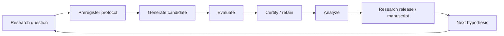

The loop is intentionally experimental rather than self-validating: a new hypothesis begins a new frozen generation instead of changing old evidence.

## 11. Deployment / repository topology

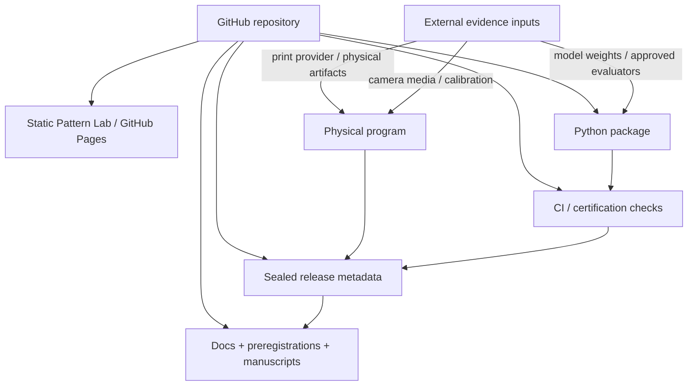

Large generated artifacts, model weights, raw datasets, credentials and sensitive environment material should remain outside normal source control and be referenced through approved manifests or retained evidence stores.

## Reading order

For a new technical reviewer:

1. `README.md` — project thesis and executive architecture.
2. `DIAGRAMS.md` — visual system map.
3. `ARCHITECTURE.md` — implementation boundaries and component responsibilities.
4. `CERTIFICATION_SYSTEM.md` — evidence ladder and refusal behavior.
5. `END_TO_END_RESEARCH_SOP.md` — operational experiment procedure.
6. `PROJECT_PROGRESS.md` — authoritative current state.
7. `papers/` — research questions and pre-results manuscripts.
