# RAC System Diagrams

**Purpose:** provide a visual map of the Ruthless Adversarial Clothing (RAC) research platform without overstating software capability as physical efficacy.

These diagrams describe system boundaries and evidence flow. A diagram may show a pathway that crosses an open experimental gate; consult [`CURRENT_PROGRAM_STATE.md`](CURRENT_PROGRAM_STATE.md) for the authoritative live program state. Frozen experiment/physical contracts and hash-pinned artifacts outrank explanatory diagrams.

The supplied diagram set has been normalized into maintainable SVG assets under `docs/assets/diagrams/`. The SVGs are explanatory renders; the Mermaid blocks below remain the editable topology source.

## 1. Executive system topology

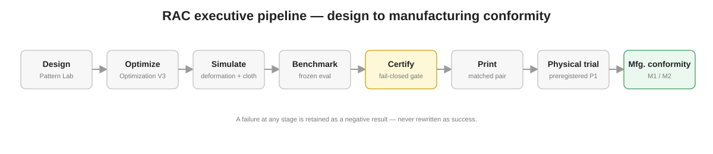

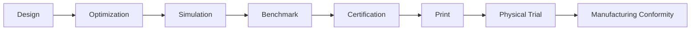

The key idea is that candidate generation is upstream of evidence. No design becomes a product claim merely because it optimized well digitally.

## 2. Four-plane architecture

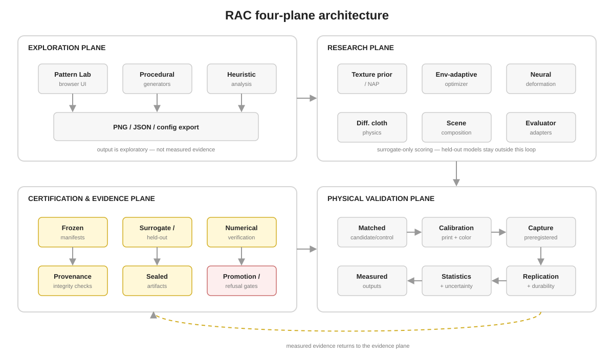

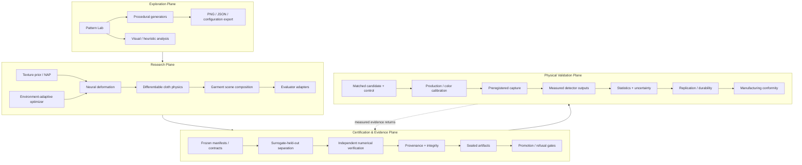

## 3. Candidate-generation topology

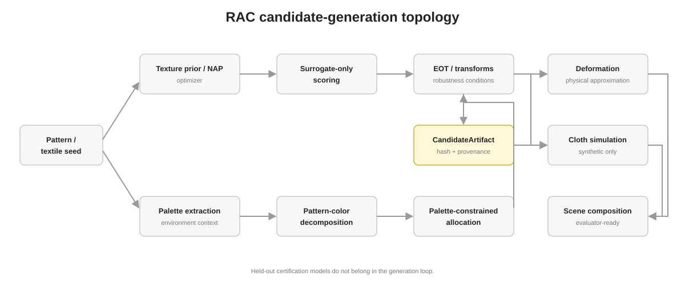

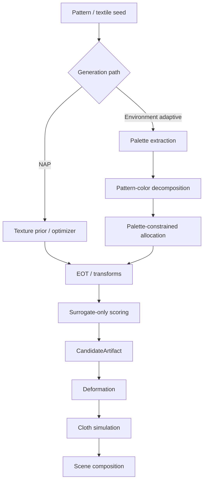

Held-out certification models do not belong in the generation loop.

## 4. Evaluation and trust boundary

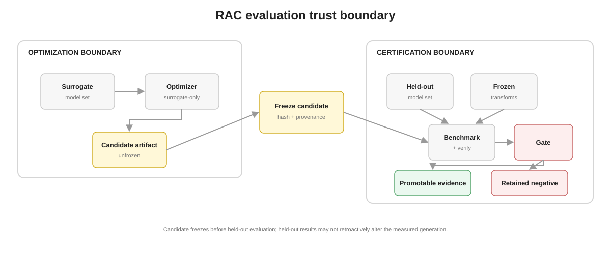

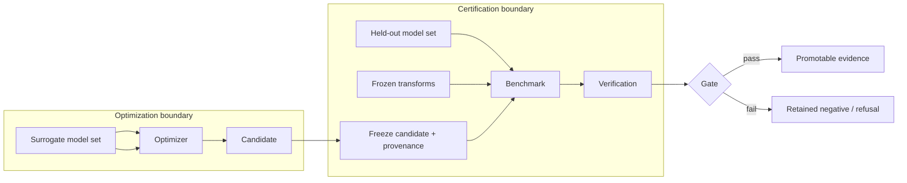

The candidate must be frozen before held-out evaluation. Held-out results may inform a later generation, but not retroactively modify the candidate whose transfer they measure.

## 5. Evidence lifecycle

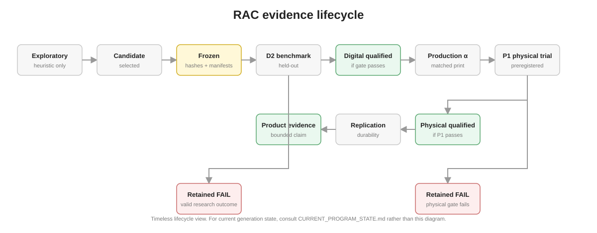

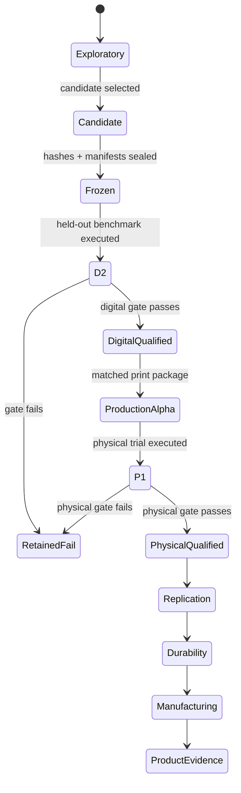

Not every generation should reach the final state. Retained failure is a valid terminal research outcome. This is a **timeless lifecycle diagram**, not a current-generation status board; use `CURRENT_PROGRAM_STATE.md` for current D2/P1 state.

## 6. Fail-closed certification flow

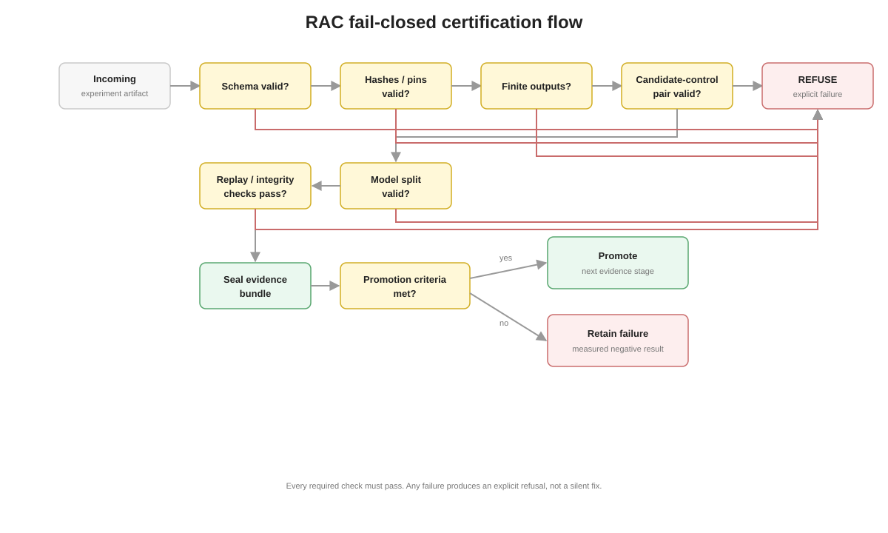

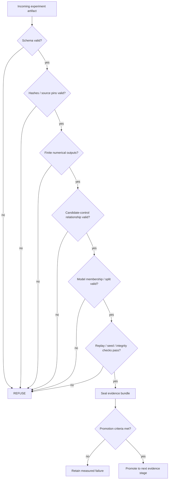

## 7. Digital-to-physical translation flow

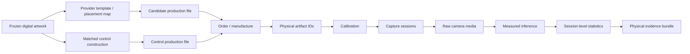

Candidate and control identities must remain distinct and traceable through the entire chain. For P1 execution authority, use the frozen P1 schedule/runbook rather than this explanatory flow.

## 8. Data and provenance topology

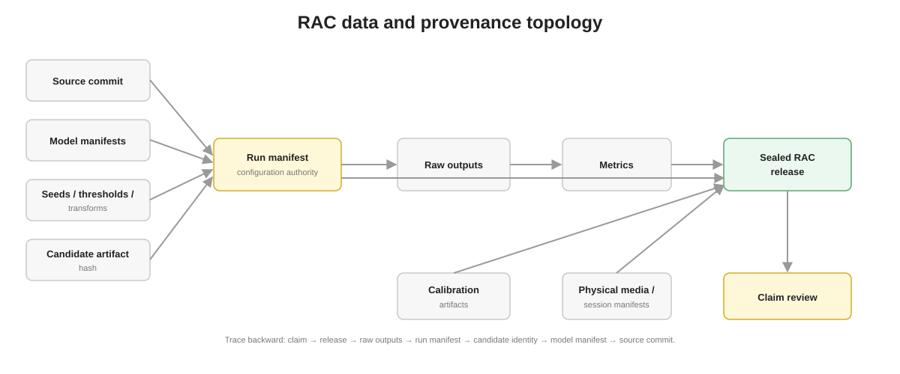

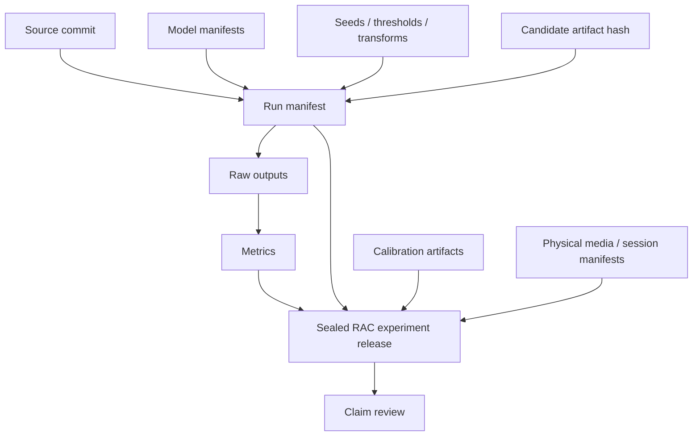

A quantitative claim should be traceable backward from the report to the release, raw outputs, run manifest, candidate identity, model manifest, and source commit.

## 9. Pattern Lab versus measured evidence

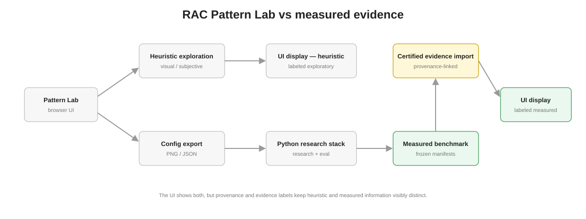

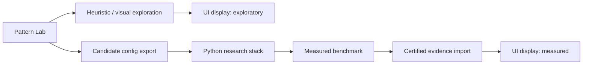

The UI may display both heuristic and measured information, but the provenance and evidence labels must make them visibly distinct.

## 10. Research feedback loop

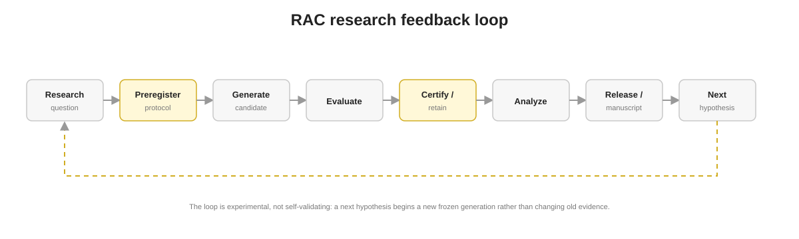

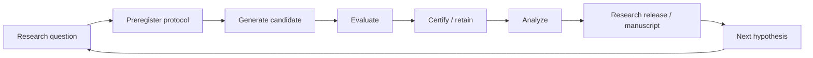

The loop is intentionally experimental rather than self-validating: a new hypothesis begins a new frozen generation instead of changing old evidence.

## 11. Deployment / repository topology

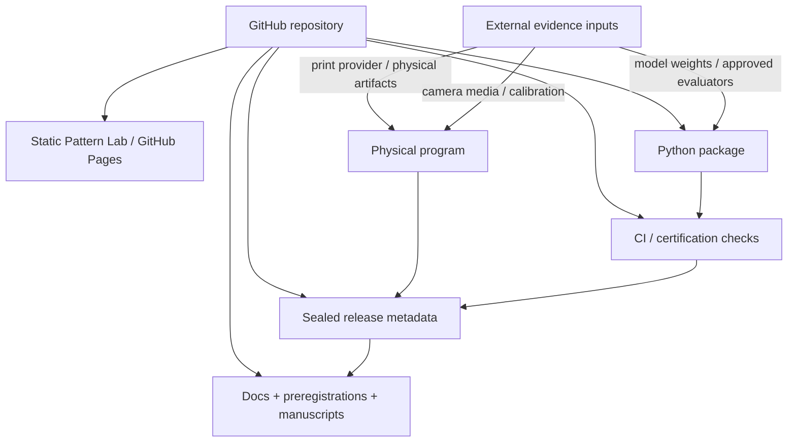

Large generated artifacts, model weights, raw datasets, credentials and sensitive environment material should remain outside normal source control and be referenced through approved manifests or retained evidence stores.

## Rendered asset inventory

| Asset | Purpose |
| --- | --- |
| `assets/diagrams/executive-pipeline.svg` | executive design-to-manufacturing flow |
| `assets/diagrams/four-plane-architecture.svg` | exploration / research / evidence / physical planes |
| `assets/diagrams/candidate-generation.svg` | candidate-generation topology |
| `assets/diagrams/evaluation-trust-boundary.svg` | surrogate vs held-out trust boundary |
| `assets/diagrams/evidence-lifecycle.svg` | generic evidence lifecycle; not live generation status |
| `assets/diagrams/fail-closed-certification.svg` | certification refusal / promotion flow |
| `assets/diagrams/data-provenance.svg` | backward provenance topology |
| `assets/diagrams/pattern-lab-vs-measured.svg` | heuristic vs measured UI separation |
| `assets/diagrams/research-feedback-loop.svg` | preregistered research feedback loop |

## Reading order

For a new technical reviewer:

1. `README.md` — project thesis and executive architecture.
2. `CURRENT_PROGRAM_STATE.md` — authoritative current program-level state.
3. `DIAGRAMS.md` — visual system map.
4. `ARCHITECTURE.md` — implementation boundaries and component responsibilities.
5. `CERTIFICATION_SYSTEM.md` — evidence ladder and refusal behavior.
6. `END_TO_END_RESEARCH_SOP.md` — operational experiment procedure.
7. `PROJECT_PROGRESS_CURRENT.md` — detailed current workstreams and verification state.
8. `papers/` — research questions and pre-results manuscripts.
