# RAC System Diagrams

**Reviewed:** 2026-09-11  
**Purpose:** visual map of the current Ruthless Adversarial Clothing research and production system without overstating software capability as physical efficacy.

These diagrams are explanatory. Frozen contracts, preregistrations, closure artifacts, and physical execution surfaces outrank them. Consult [`CURRENT_PROGRAM_STATE.md`](CURRENT_PROGRAM_STATE.md) for the canonical live program state.

## 1. Executive system topology

Candidate generation is upstream of evidence. No design becomes a physical claim because it looks adversarial or scores well digitally.

## 2. Four-plane architecture

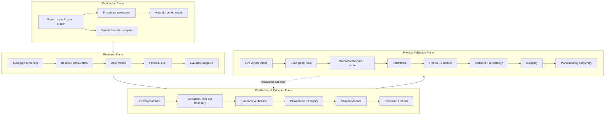

## 3. Earned-complexity research path

RAC supports early scientific screening so expensive downstream machinery is built only when a hypothesis earns it.

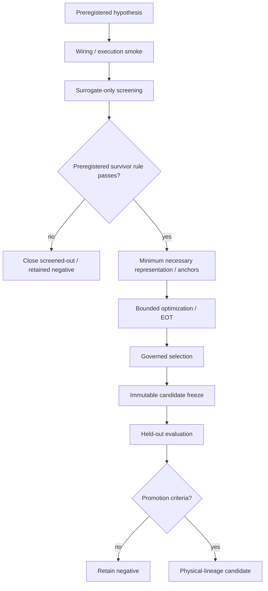

D2-0007 followed this topology and stopped at the Stage-1 screen with zero survivors.

## 4. D2-0007 actual closure

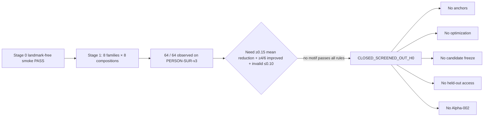

This is a terminal scientific result for that preregistered generation, not an unfinished pipeline.

## 5. Surrogate / held-out trust boundary

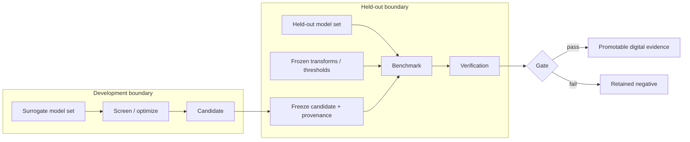

Held-out feedback does not flow backward into the same candidate.

## 6. Alpha-001 identity and recovery

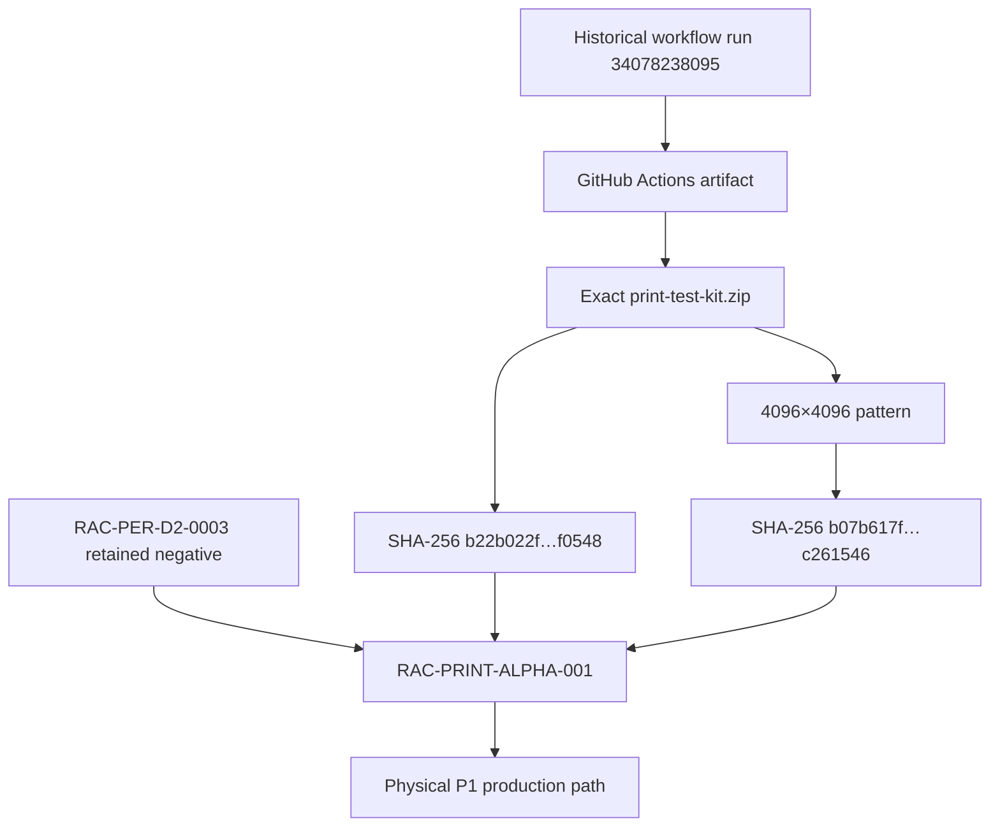

Alpha-001 remains bound to D2-0003. The recovered source was not regenerated or retuned.

## 7. Production release flow

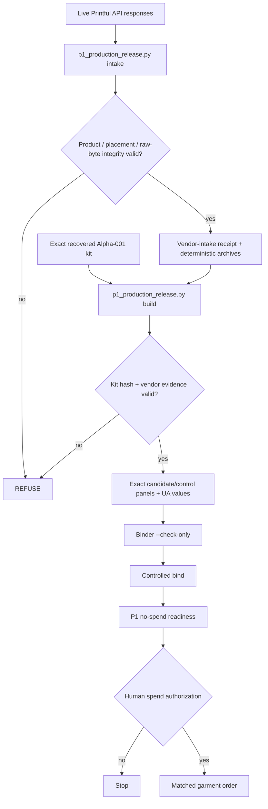

The production release wrapper never places an order by itself.

## 8. Physical P1 flow

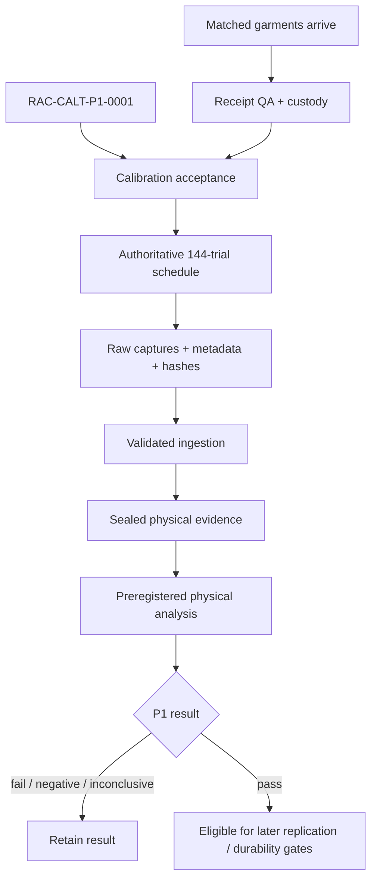

Older 108-row planning material is not execution authority.

## 9. P1 authority stack

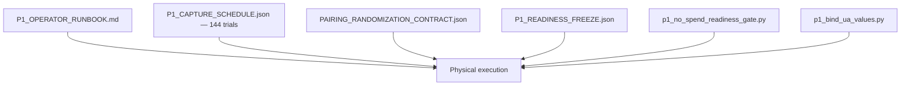

All explanatory docs are subordinate to this frozen execution surface.

## 10. Fail-closed evidence flow

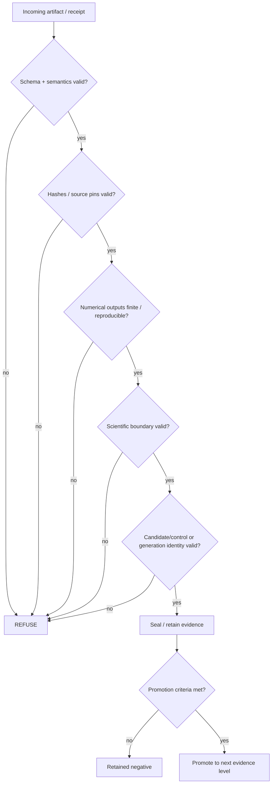

## 11. Evidence lifecycle

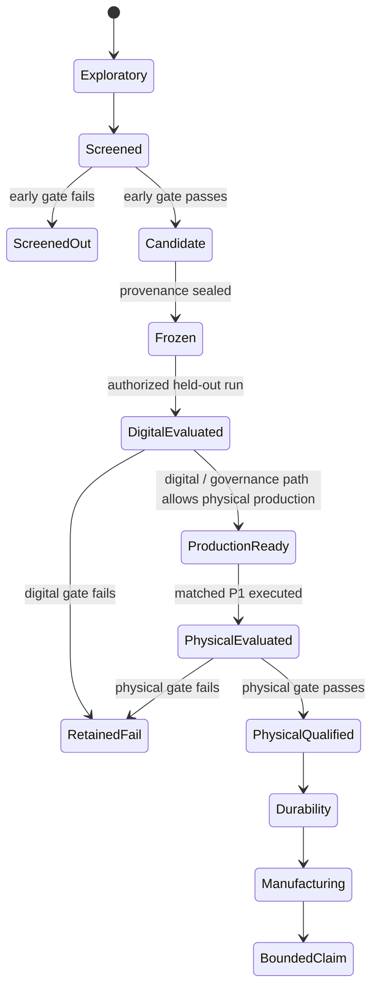

Retained failure and screened-out states are valid terminal research outcomes.

## 12. Claim-to-source provenance

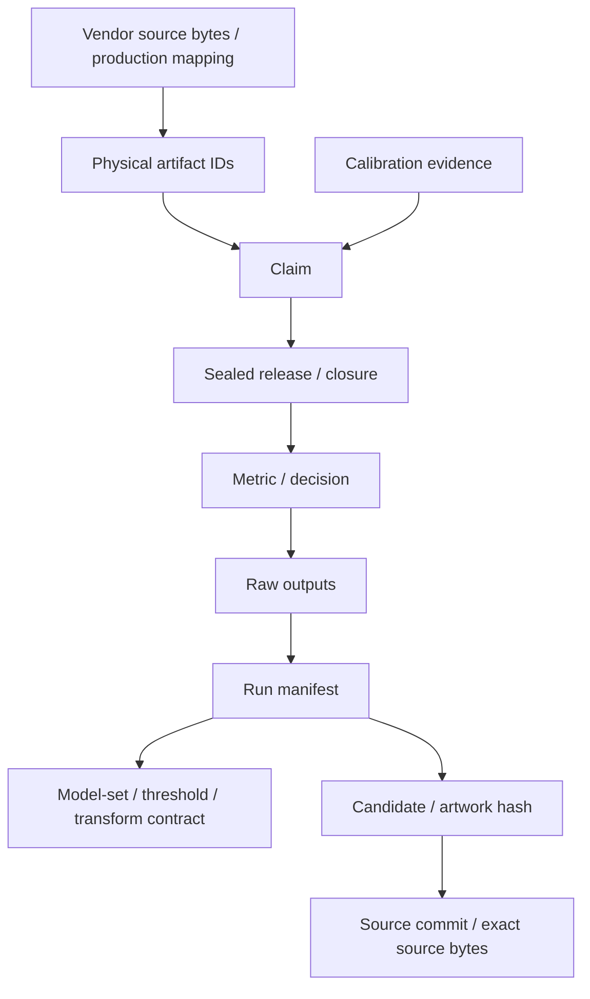

A physical claim adds manufacturing, custody, calibration, and raw-media provenance to the digital chain.

## 13. Current terminal/open states

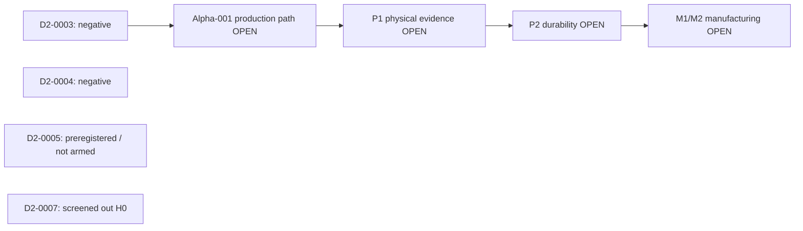

The next program-defining milestone is admissible P1 physical evidence.
