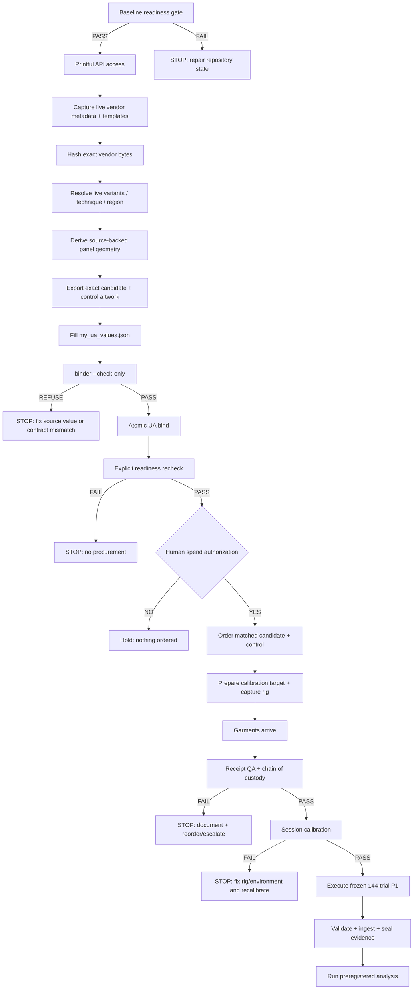

# RAC Physical P1 — Direct Links + Visual Operator Guide

**Document ID:** RAC-USER-ACTION-VISUAL-001  
**Companion to:** `docs/USER_ACTION_NEXT_STEPS.md`  
**Audience:** human operator  
**Purpose:** Put the external destinations, repository entry points, visual flow, and screen-level sanity checks in one place so the P1 transition can be followed without hunting through documentation.

> **Authority:** this is a navigation aid. Frozen P1 contracts and hash-pinned artifacts remain authoritative. The current P1 schedule is **144 trials**. Do not execute the historical 108-row Print Alpha planning sheet.

## 1. Direct-access links

### Printful — external actions

| Need | Direct link | Use it for |
|---|---|---|
| Printful dashboard | https://www.printful.com/dashboard | Sign in, manage products/orders, and reach account/store settings |
| Printful Developer Portal | https://developers.printful.com/ | Create/use API access and read current API documentation |
| Printful API documentation | https://developers.printful.com/docs/ | Verify authentication, Catalog API, Mockup Generator, print-file/template fields, and techniques |
| Printful AOP hoodie — product 388 | https://www.printful.com/custom/mens/hoodies/all-over-print-recycled-unisex-hoodie?productId=388 | Open the primary hoodie product and its File guidelines / Design Maker |
| Printful print-file preparation guide | https://help.printful.com/hc/en-us/articles/28491464259740-How-should-I-prepare-my-print-file-for-the-best-results | File type, resolution, sRGB, product File guidelines, safe zones |
| Printful AOP guide | https://help.printful.com/hc/en-us/articles/21045992765468-What-is-AOP-and-how-does-all-over-printing-work | Understand full bleed, safe areas, cut-and-sew AOP behavior |
| Printful AOP technical caveats | https://help.printful.com/hc/en-us/articles/360014007460-What-should-I-know-about-all-over-printing | Manufacturing/placement variability to account for during QA |
| Printful Design Maker guide | https://help.printful.com/hc/en-us/articles/360014067779-How-does-the-Design-Maker-work | Upload, position, pattern-fill, preview, and save production designs |

### RAC — repository entry points

| Need | Direct link |
|---|---|
| Current operator checklist | https://github.com/ninja-ops-guy/adversarial-clothing-pipeline/blob/main/docs/USER_ACTION_NEXT_STEPS.md |
| Canonical program state | https://github.com/ninja-ops-guy/adversarial-clothing-pipeline/blob/main/docs/CURRENT_PROGRAM_STATE.md |
| UA values template | https://github.com/ninja-ops-guy/adversarial-clothing-pipeline/blob/main/physical/p1/UA_VALUES_TEMPLATE.json |
| Fail-closed UA binder | https://github.com/ninja-ops-guy/adversarial-clothing-pipeline/blob/main/tools/p1_bind_ua_values.py |
| P1 no-spend readiness gate | https://github.com/ninja-ops-guy/adversarial-clothing-pipeline/blob/main/tools/p1_no_spend_readiness_gate.py |
| P1 operator runbook | https://github.com/ninja-ops-guy/adversarial-clothing-pipeline/blob/main/physical/p1/P1_OPERATOR_RUNBOOK.md |
| Frozen 144-trial schedule | https://github.com/ninja-ops-guy/adversarial-clothing-pipeline/blob/main/physical/p1/P1_CAPTURE_SCHEDULE.json |
| Pairing/randomization contract | https://github.com/ninja-ops-guy/adversarial-clothing-pipeline/blob/main/physical/p1/PAIRING_RANDOMIZATION_CONTRACT.json |
| Readiness freeze | https://github.com/ninja-ops-guy/adversarial-clothing-pipeline/blob/main/physical/p1/P1_READINESS_FREEZE.json |
| Camera/lighting setup | https://github.com/ninja-ops-guy/adversarial-clothing-pipeline/blob/main/physical/p1/CAMERA_LIGHTING_SETUP.md |
| Latest readiness audit | https://github.com/ninja-ops-guy/adversarial-clothing-pipeline/blob/main/docs/audits/P1_NO_SPEND_READINESS_AUDIT.md |

## 2. Visual: the whole path



## 3. Visual: what to click in Printful

### A. Get to the product-specific file guide

```text
Printful product 388 page
        │
        ├── Product / description
        ├── File guidelines   ← OPEN THIS
        │      ├── choose the correct AOP technique
        │      ├── download the vendor-provided template if offered
        │      └── note safe area / bleed / required resolution
        │
        └── Start designing / Design Maker
               ├── upload candidate artwork
               ├── inspect each required placement
               ├── check print-quality warnings
               └── preview only after geometry is correct
```

**What you should see:** product-specific print guidance rather than a generic canvas. Printful documents that the product page's **File guidelines** section provides product-specific templates with dimensions, print area, and safe zones. If those controls are absent or the product/technique is not what you expected, stop before binding values.

### B. API/template relationship

```text
Printful live product
      │
      ├── Catalog / variant response
      │      └── real product + variant identity
      │
      ├── /mockup-generator/printfiles/{product}
      │      └── print-file IDs, placements, resolution/aspect information
      │
      ├── /mockup-generator/templates/{product}
      │      └── template IDs + image URL + print-area geometry
      │
      └── Product page → File guidelines
             └── downloadable production template when Printful provides one
```

**Do not conflate these:** API JSON is vendor metadata. A template image/archive is a separate artifact. Hash the exact object represented by each manifest field; never rename JSON to `.zip` or use a metadata hash as an archive hash merely to make the binder pass.

## 4. Visual: candidate/control matching

```text
                         MATCHED PAIR

              Candidate                  Control
          ┌────────────────┐         ┌────────────────┐
Product   │ product 388    │   =     │ product 388    │
Variant   │ same variant   │   =     │ same variant   │
Size      │ same size      │   =     │ same size      │
Technique │ same technique │   =     │ same technique │
Region    │ matched        │   ≈     │ matched        │
Wash      │ W0             │   =     │ W0             │
Artwork   │ candidate      │   ≠     │ control        │
          └────────────────┘         └────────────────┘

Goal: artwork is the intended experimental difference; avoid introducing
product, size, substrate, technique, fulfillment, or wash-state differences.
```

## 5. Visual: safe area versus bleed

```text
┌──────────────────────────────────────────────┐
│ FULL BLEED / PRINT EXTENT                    │
│ Artwork should cover this where required.   │
│   ┌──────────────────────────────────────┐   │
│   │ SAFE AREA                            │   │
│   │ Keep critical motifs/details here.   │   │
│   │                                      │   │
│   └──────────────────────────────────────┘   │
│ Edge/seam region: expect manufacturing       │
│ tolerance; don't rely on exact alignment.    │
└──────────────────────────────────────────────┘
```

Printful recommends full-bleed files for AOP, keeping important content inside the safe area. For this experiment, use the actual vendor template rather than this conceptual diagram for dimensions.

## 6. Visual: binder workflow

```text
UA_VALUES_TEMPLATE.json
        │ copy
        ▼
my_ua_values.json
        │ fill ONLY with real source-backed values
        ▼
python3 tools/p1_bind_ua_values.py --values my_ua_values.json --check-only
        │
        ├── refusal → ZERO intended binding writes → correct source/contract
        │
        └── PASS
             ▼
python3 tools/p1_bind_ua_values.py --values my_ua_values.json
             │
             ├── allowlisted manifests/readiness evidence
             └── artifacts/p1-readiness/ua-binding-receipt.json
                         │
                         ▼
python3 tools/p1_no_spend_readiness_gate.py
                         │
                         └── REQUIRE PASS before spend
```

## 7. Visual: physical capture gate

```text
Delivered garments
      │
      ▼
Identity + variant + material + print QA
      │
      ├── FAIL ──> quarantine/document/reorder
      │
      └── PASS
           ▼
Chain of custody
           ▼
Calibration target in locked rig
           │
           ├── FAIL ──> fix rig/environment; repeat calibration
           │
           └── PASS
                ▼
       Frozen 144-trial schedule
                ▼
       Raw captures + metadata
                ▼
       Validation / ingestion
                ▼
          SEALED EVIDENCE
                ▼
       Preregistered analysis
```

## 8. Screen-level sanity checks

Before leaving each stage, verify the screen/file you are looking at matches the expected identity:

1. **Product page:** product 388 and the expected hoodie name; do not continue from a visually similar product.
2. **Technique:** the selected/live technique must correspond to the product configuration you will actually order.
3. **Variant:** size and variant ID must come from live vendor data and agree with the intended garment.
4. **Template:** placement names and print areas must belong to that product/variant/technique.
5. **Design Maker:** no unresolved print-quality warning; artwork covers the intended AOP area; critical content is not accidentally placed outside safe areas.
6. **Order review:** candidate/control line items match on product, variant, size and technique; uploaded artwork is the intended differing variable.
7. **RAC binder:** check-only passes before any binding.
8. **RAC readiness:** explicit gate PASS before spend and again before P1 if repository state has changed.
9. **P1 run:** the schedule being executed is `physical/p1/P1_CAPTURE_SCHEDULE.json` and contains the authoritative 144 trials.

## 9. What not to trust visually

A mockup is a visualization, not evidence that the production file geometry or experiment is valid. Do not use a mockup screenshot as the source for panel dimensions, hashes, variant IDs, or efficacy. Printful also warns that AOP manufacturing can shift placement, so exact visual alignment at seams should not be assumed. Use live template/print-file data for production mapping and receipt QA for the delivered result.

## 10. One-screen operator card

```text
OPEN FIRST
  RAC checklist: docs/USER_ACTION_NEXT_STEPS.md
  Printful:       https://www.printful.com/dashboard
  API docs:       https://developers.printful.com/docs/

NO-SPEND
  [ ] readiness baseline PASS
  [ ] token works and stays outside repo
  [ ] live 388/257 vendor data captured
  [ ] real template artifacts captured where required
  [ ] files hashed
  [ ] variants / technique / region verified
  [ ] panel geometry source-backed
  [ ] final candidate/control bytes hashed
  [ ] UA intake complete
  [ ] binder --check-only PASS
  [ ] atomic bind PASS
  [ ] explicit readiness recheck PASS

SPEND / PHYSICAL
  [ ] human authorizes spend
  [ ] matched hoodie pair ordered
  [ ] calibration target + rig ready
  [ ] receipt QA PASS
  [ ] calibration PASS
  [ ] frozen 144-trial schedule executed
  [ ] evidence validated + sealed
  [ ] preregistered analysis run

ALWAYS STOP ON
  guessed UA value / vendor-contract mismatch / hash mismatch /
  binder refusal / readiness FAIL / pair mismatch / QA FAIL /
  calibration FAIL / unexpected protected-state change
```
