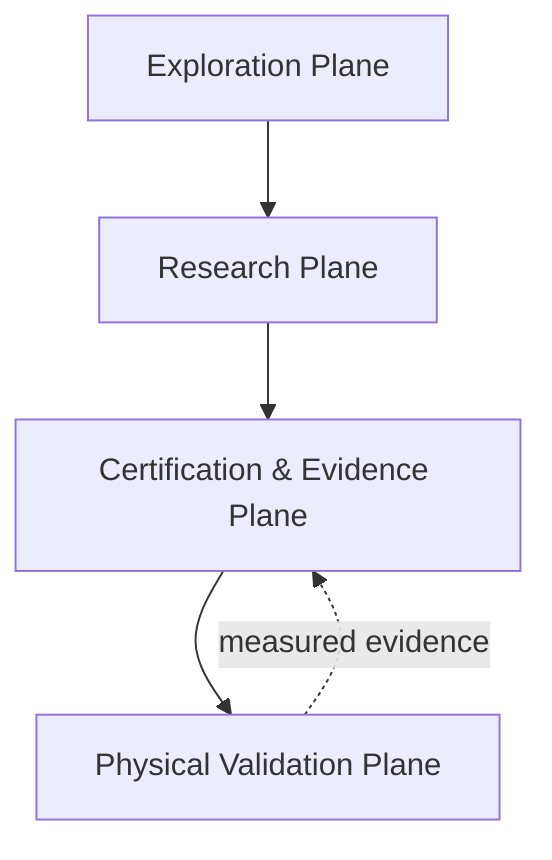
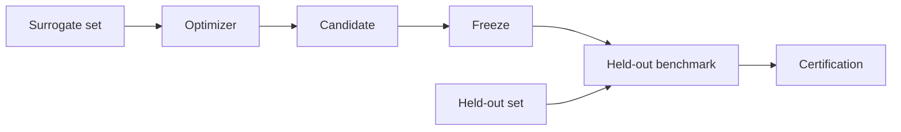

# RAC: A Reproducible Architecture for Physical Adversarial Textile Research

**Status:** Pre-results methods manuscript  
**Evidence rule:** software architecture may be described as implemented capability; efficacy claims remain pending experimental evidence.

## Abstract

Physical adversarial research crosses several domains that are often evaluated separately: digital optimization, geometric deformation, rendering or scene composition, machine-vision evaluation, manufacturing, physical capture, statistics and reproducibility. This separation creates a methodological risk: an apparently strong digital result can be promoted into a physical claim without preserving the provenance, held-out boundaries or manufacturing state needed to reproduce it.

This paper presents the Ruthless Adversarial Clothing (RAC) architecture, an experimental physical-AI robustness platform designed to connect candidate generation to physical validation while preserving explicit evidence boundaries. RAC organizes the research process into four planes: exploration, research, certification/evidence and physical validation. The architecture separates surrogate-guided generation from held-out evaluation, freezes candidates before certification, binds experimental outputs to manifests and hashes, supports deterministic replay and independent numerical verification, and treats physical manufacturing and camera capture as evidence stages that cannot be replaced by simulation. The system also preserves valid negative results and fails closed when provenance, numerical integrity or candidate/control identity cannot be established.

The contribution of this work is not a claim that adversarial apparel is physically effective. Instead, RAC proposes and implements a reproducible research architecture for determining when such a claim would be justified, when it would be rejected, and which artifacts are required to audit the decision.

**Results:** RESULTS PENDING for physical efficacy. Architecture and software behavior are implemented and tested independently from product-effect claims.

## 1. Introduction

Adversarial examples demonstrate that learned visual systems can be sensitive to structured perturbations. Translating this phenomenon from digital images to physical artifacts introduces a substantially harder problem. A textile pattern must survive changes in pose, fabric deformation, camera geometry, lighting, printing, color reproduction, compression, environmental context and model architecture. A result that appears robust in a digital optimization loop may disappear after any one of these transitions.

The core methodological problem is therefore not only how to generate an adversarial candidate, but how to construct a research process in which each transition is observable, reproducible and bounded by a defined evidence contract.

RAC was designed around this problem. Its central principle is:

> **Candidate generation is upstream of evidence.**

The architecture therefore distinguishes exploratory design, surrogate-side optimization, held-out digital evaluation, evidence certification, manufacturing, physical capture and post-manufacturing validation as separate stages.

## 2. Research Questions

This architecture paper asks:

**RQ1.** How should a physical adversarial research system separate exploratory generation from measured evidence?

**RQ2.** How can surrogate-guided optimization be prevented from contaminating held-out evaluation?

**RQ3.** What provenance and integrity information is required to make a reported result auditable?

**RQ4.** How should invalid numerical states, stale mappings, corrupt artifacts and mismatched physical controls be handled?

**RQ5.** How can digital evidence be connected to physical manufacturing and capture without treating simulation as physical proof?

## 3. System Model

RAC uses four execution and evidence planes.

### 3.1 Exploration Plane

The Exploration Plane contains Pattern Lab and related human-facing tooling. It supports procedural design generation, parameter selection, visual review, heuristic analysis, history and export.

Its outputs are candidates and configurations, not automatically measured efficacy.

### 3.2 Research Plane

The Research Plane contains the machine-optimized research path:

```text
texture prior / environment-adaptive optimizer
  -> neural deformation
  -> differentiable cloth simulation
  -> garment scene composition
  -> evaluator adapters
  -> surrogate evaluation
  -> frozen CandidateArtifact
```

The research plane may use surrogate models during generation. It must not use the held-out certification set to revise the candidate under evaluation.

### 3.3 Certification and Evidence Plane

The Certification Plane validates whether an experimental output is admissible under the declared protocol. It includes:

- frozen schemas and manifests;
- model-set membership checks;
- surrogate/held-out separation;
- baseline preservation;
- deterministic replay;
- independent numerical verification;
- finite-value checks;
- provenance and hash validation;
- candidate/control identity checks;
- stale source-mapping refusal;
- failure injection;
- sealed evidence bundles;
- explicit promotion or refusal.

### 3.4 Physical Validation Plane

The Physical Plane binds the digital artifact to a manufactured object and measured camera experiment:

```text
frozen candidate
  -> candidate production file
  -> matched control production file
  -> physical artifact identity
  -> calibration
  -> preregistered capture
  -> raw media
  -> measured inference
  -> session-level statistics
  -> replication / durability
  -> manufacturing conformity
```

The system does not permit simulation to substitute for this evidence.

## 4. Architecture Topology



The feedback edge from the physical plane to certification represents measured evidence entering a validation process, not an optimization feedback channel for the already-evaluated candidate.

## 5. Surrogate and Held-Out Separation

A central RAC trust boundary is the division between optimization models and certification models.



The candidate becomes immutable before held-out access. If held-out results motivate a new design, the new design receives a new experimental identity.

This prevents an evaluation set from becoming an implicit training set through repeated manual or automated adjustment.

## 6. Reproducibility Contract

A measured digital result should be traceable to:

- source commit;
- candidate artifact hash;
- run manifest;
- model manifest;
- preprocessing configuration;
- thresholds;
- random seeds;
- transformation configuration;
- raw outputs;
- aggregate metrics;
- verification outputs;
- sealed release identity.

Physical evidence additionally requires:

- production mapping;
- candidate/control identity;
- provider/template state;
- artifact identity;
- calibration artifacts;
- capture-session manifests;
- raw camera media;
- session-level statistical outputs.

## 7. Fail-Closed Design

RAC follows a refusal-first rule for ambiguous evidence states.

Examples include:

- invalid schema;
- wrong artwork or template hash;
- corrupt checkpoint;
- non-finite objective value;
- unknown detector family;
- missing provenance edge;
- synthetic evidence mislabeled as measured;
- candidate/control mismatch;
- stale production mapping.

The intended behavior is explicit refusal rather than silent recovery.

This differs from ordinary application robustness. In an evidence system, recovering from an invalid state can be worse than failing because it may create a plausible but untraceable result.

## 8. Independent Numerical Verification

RAC includes numerical checks implemented independently from the primary optimization code where practical. The verification layer evaluates:

- deterministic rerun agreement;
- finite-value behavior;
- seed reproducibility;
- objective decomposition;
- Pareto reference behavior;
- mean and CVaR reference calculations;
- transformation-seed reproduction;
- checkpoint and artifact integrity.

Independent reference calculations reduce the risk that a shared implementation error causes both the primary system and its tests to agree incorrectly.

## 9. Negative Results as First-Class Outputs

RAC explicitly retains valid negative generations. A failure to meet a performance gate is not equivalent to an invalid experiment.

The distinction is:

- **invalid experiment:** evidence contract cannot be established; certification refuses the result;
- **valid negative experiment:** contract is valid, measurement is admissible, but performance criteria are not met.

The latter remains part of the research record and can contribute to later analysis.

## 10. Digital-to-Physical Translation

The architecture treats manufacturing as a transformation that itself requires provenance.

A physical test must be able to answer:

1. Which frozen digital artwork produced this garment?
2. Which provider template and placement were used?
3. Which physical artifact is the candidate?
4. Which physical artifact is the matched control?
5. What calibration state was used?
6. Under which capture protocol was the result measured?

Without this chain, a physical result may be interesting but not reproducible.

## 11. Generalization Beyond Apparel

Although RAC uses adversarial clothing as its flagship application, the architecture is more general. The same research topology can support authorized physical-AI robustness studies involving:

- printed surfaces;
- signage;
- vehicle graphics;
- robotic perception targets;
- warehouse markings;
- other camera-visible physical artifacts.

The reusable component is the evidence-preserving path from candidate generation through physical measurement.

## 12. Limitations

RAC does not establish universal physical adversarial robustness.

Current limitations include:

- real physical efficacy remains experiment-dependent;
- simulation fidelity is bounded by available calibration;
- model transfer cannot be inferred beyond tested model families;
- camera and ISP diversity require empirical coverage;
- print and textile manufacturing introduce uncontrolled or partially controlled variation;
- long-term durability requires repeated physical measurement;
- the architecture can improve evidence quality but cannot guarantee an adversarial effect exists.

## 13. Responsible Research Boundary

The evaluator and black-box interfaces are intended for systems owned by or explicitly authorized for the operator to evaluate. The architecture intentionally separates general research infrastructure from vendor-specific surveillance integrations.

## 14. Reproducibility Statement

The software repository contains the architecture, manifests, certification logic, verification utilities, documentation and pre-results protocols. Large model weights, protected credentials, raw datasets and physical evidence may remain external but must be referenced by frozen identity and integrity metadata when used in an experiment.

The repository's `DIAGRAMS.md`, `ARCHITECTURE.md`, `CERTIFICATION_SYSTEM.md`, `RESEARCH_RELEASE_FORMAT.md` and `END_TO_END_RESEARCH_SOP.md` define the current system contract.

## 15. Results

**RESULTS PENDING.**

This manuscript does not claim physical efficacy. Experimental D2/P1/M results should be added only from immutable closed RAC experiment releases.

## 16. Discussion

**RESULTS-DEPENDENT DISCUSSION PENDING.**

The architectural contribution can be evaluated independently of physical efficacy: RAC demonstrates a system design in which optimization, certification and physical validation are separated by explicit evidence boundaries. Future results will determine whether specific candidate-generation strategies produce robust physical effects under those constraints.

## 17. Conclusion

RAC reframes physical adversarial textile research as an evidence-engineering problem as well as an optimization problem. Its four-plane architecture is designed to make the path from candidate generation to physical claim explicit, reproducible and auditable. Whether a specific adversarial garment succeeds is an empirical question; the architecture is intended to make that question answerable without collapsing exploration, optimization and evidence into the same loop.
