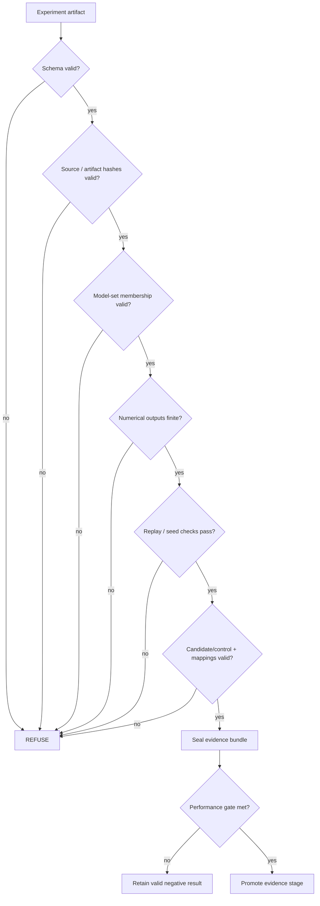

# Fail-Closed Evidence Certification for Physical-AI Experiments

**Status:** Pre-results methods manuscript  
**Scope:** evidence integrity, reproducibility, promotion/refusal logic and research release design.

## Abstract

Experimental machine-learning systems often optimize for runtime continuity: missing inputs are substituted, malformed values are sanitized, stale caches are reused, and partial outputs are accepted to keep a workflow moving. Those behaviors can be appropriate in product software but are dangerous in a research evidence pipeline, where a plausible output with broken provenance may be worse than no output at all.

This paper presents the fail-closed evidence-certification architecture used by the Ruthless Adversarial Clothing (RAC) physical-AI research platform. The certification layer separates experimental execution from evidentiary admissibility. It validates schemas, source and artifact hashes, model-set membership, surrogate/held-out separation, deterministic replay, seed reproducibility, finite numerical behavior, objective calculations, candidate/control identity, production mappings and release provenance before permitting promotion to a higher evidence stage. Invalid states are explicitly refused. Valid experiments that fail performance thresholds are retained as negative results rather than discarded.

The paper argues that fail-closed behavior is a useful design pattern for experimental AI infrastructure, particularly when digital optimization must be connected to physical artifacts and measurements. RAC's implementation serves as a concrete case study; efficacy results remain outside the scope of this methods paper.

## 1. Motivation

Research pipelines frequently inherit software-engineering assumptions from production applications. Production systems often attempt graceful degradation. For example, a missing value may be replaced by a default, an unavailable service may be bypassed, or an invalid numeric result may be clipped into range.

In an experimental evidence system, those same behaviors can destroy interpretability. If a model result was produced using the wrong candidate, a stale production mapping, a corrupted checkpoint or a NaN that was silently replaced, the resulting table may look valid even though its scientific meaning is undefined.

RAC therefore adopts the opposite default:

> **When evidence integrity cannot be established, refuse promotion.**

## 2. Evidence States

RAC distinguishes three broad outcomes:

1. **Valid positive evidence** — the experiment contract is intact and performance criteria are met.
2. **Valid negative evidence** — the experiment contract is intact but performance criteria are not met.
3. **Invalid / inadmissible state** — the contract cannot be established, so no performance interpretation is permitted.

The third category is not a negative experimental result. It is a refusal to treat the output as evidence.

## 3. Certification Pipeline



The sequencing matters. Performance evaluation is meaningful only after the artifact is determined to be admissible.

## 4. Threat Model

The certification layer is intended to detect or prevent errors such as:

- accidental candidate substitution;
- stale source-to-production mappings;
- candidate/control self-mapping;
- wrong template or artwork hashes;
- invalid or incomplete schemas;
- model-set leakage;
- corrupt checkpoints;
- non-finite objectives;
- nondeterministic reruns where determinism is required;
- synthetic outputs mislabeled as measured evidence;
- broken provenance links;
- inconsistent transformation seeds;
- silently changed baseline behavior.

The primary threat is not a malicious external attacker. It is **research drift**: the gradual accumulation of small implementation or process errors that can make an experimental result impossible to interpret.

## 5. Frozen Contracts

RAC uses frozen schemas and manifests to declare the expected state of an experiment before or during execution. Depending on the stage, a contract may include:

- candidate identity;
- source commit;
- model membership;
- preprocessing rules;
- thresholds;
- random seeds;
- transform distributions;
- production mappings;
- control identity;
- calibration references;
- release contents.

A contract allows the system to distinguish an intended experiment from a merely executable one.

## 6. Candidate / Control Pairing

Physical experiments require a matched control and candidate. A superficially valid production mapping can still be meaningless if both sides resolve to the same file or to mismatched trial identities.

RAC therefore treats the candidate/control relationship as a certification invariant rather than a naming convention.

At minimum, the system should verify:

- candidate and control resolve to distinct files;
- both belong to the same declared trial when a trial naming convention is used;
- the mapping references the intended source manifest;
- the source manifest itself is hash-pinned;
- missing or stale source files cause refusal.

This prevents a physically manufactured pair from becoming detached from the experiment that supposedly produced it.

## 7. Stale-Mapping Detection

Production workflows are especially vulnerable to stale metadata. A mapping can remain syntactically valid even after the source artwork, SKU manifest or trial sheet changes.

RAC mitigates this by pinning the source manifest with a cryptographic digest and recomputing that digest during validation.

```text
source manifest
   -> SHA-256 pin
   -> production mapping
   -> validation recomputes source SHA-256
   -> mismatch => REFUSE
```

This turns staleness from a human-review concern into an explicit machine-checkable condition.

## 8. Numerical Refusal

Non-finite values are dangerous because many numerical libraries will continue propagating NaN or infinity through later calculations.

RAC treats non-finite stage outputs as certification failures. A result should not be made apparently valid through clipping, replacement or omission unless such behavior was itself declared in the frozen protocol.

The independent numerical-verification layer checks:

- finiteness;
- deterministic rerun behavior;
- seed reproducibility;
- objective decomposition;
- reference mean / CVaR calculations;
- Pareto-dominance behavior;
- transformation-seed consistency;
- checkpoint and artifact integrity.

## 9. Independent Reference Calculations

Testing an implementation only with code that shares the same underlying logic creates a risk of common-mode failure. RAC therefore uses independent reference calculations where feasible.

For example, a primary objective implementation may be cross-checked against a separately written reference implementation using a simpler direct calculation. Agreement does not prove correctness, but disagreement is highly informative and prevents some categories of silent shared-code drift.

## 10. Baseline Preservation

A research system may evolve while historical experiments remain part of the evidence record. Silent changes in baseline behavior can therefore make old and new results incomparable.

RAC uses characterization fixtures and reference manifests to pin deterministic baseline outputs. Regeneration requires explicit intent rather than occurring as a side effect of normal test execution.

This provides a machine-detectable signal when code changes alter historical behavior.

## 11. Failure Injection

Fail-closed behavior should be tested by deliberately creating invalid states.

RAC's failure-injection approach includes conditions such as:

- missing artwork;
- incorrect artwork hash;
- incorrect template hash;
- invalid schema;
- missing model reference;
- duplicate fixture;
- corrupt checkpoint;
- NaN objective;
- invalid transformation distribution;
- unknown detector family;
- missing or tampered provenance edge;
- synthetic evidence mislabeled as measured;
- candidate/control mismatch;
- stale production mapping.

Each case should assert an explicit refusal rather than merely expecting an exception somewhere downstream.

## 12. Promotion Versus Valid Failure

A key design distinction is between **certification** and **performance**.

Certification asks:

> Is this result interpretable under the declared contract?

Performance asks:

> Given that it is interpretable, did it meet the preregistered criterion?

This produces the following outcome matrix:

| Contract valid? | Performance gate met? | Outcome |
|---|---|---|
| No | Unknown / irrelevant | REFUSE / inadmissible |
| Yes | No | Retained valid negative result |
| Yes | Yes | Promotable evidence |

This prevents poor performance from being confused with bad methodology and prevents bad methodology from being disguised as poor performance.

## 13. Sealed Releases

Once an experiment closes, RAC can package its admissible artifacts into a sealed research release. The purpose is to preserve the exact relationship among:

- candidate;
- protocol;
- model manifest;
- raw outputs;
- aggregate metrics;
- verification results;
- provenance metadata;
- source commit.

The sealed release is the evidence object referenced by later analyses and manuscripts.

## 14. Physical-AI Relevance

Fail-closed certification becomes more important when software controls a physical experiment. The number of identity transitions increases:

```text
candidate array
 -> exported artwork
 -> production file
 -> provider placement
 -> manufactured garment
 -> camera capture
 -> inference output
 -> aggregate statistic
```

Every transition creates an opportunity for silent mismatch. Physical-AI research therefore benefits from treating provenance as a graph of identities rather than a folder of outputs.

## 15. General Applicability

The method is not specific to adversarial clothing. Similar evidence-integrity requirements appear in:

- robotics experiments;
- autonomous-system testing;
- hardware-in-the-loop evaluation;
- sensor-fusion research;
- red-team model evaluation;
- physical adversarial examples;
- manufacturing experiments;
- reproducible benchmark infrastructure.

Any system in which an experimental result crosses several software and physical transformations can benefit from explicit refusal semantics.

## 16. Limitations

Fail-closed certification does not guarantee scientific truth. It can enforce declared contracts, integrity and reproducibility conditions, but it cannot ensure that the chosen protocol answers the right research question.

Additional limitations include:

- a frozen protocol can still be poorly designed;
- a correct hash proves identity, not semantic suitability;
- deterministic behavior is not required or desirable for every experiment;
- independent reference implementations may still share conceptual errors;
- physical calibration and measurement uncertainty remain empirical problems;
- provenance infrastructure adds operational overhead.

## 17. Results

**RESULTS PENDING / NOT APPLICABLE TO EFFICACY.**

The present manuscript describes implemented evidence-infrastructure behavior. Physical adversarial performance is outside the scope of this paper and must be reported from closed experiment releases.

## 18. Discussion

RAC's certification model treats refusal as a successful safety property of the research system. A pipeline that refuses an uninterpretable result may be less convenient than one that continues, but it preserves the boundary between execution and evidence.

This distinction is especially important in AI research where complex pipelines can produce highly persuasive metrics even when an upstream identity or numerical invariant has been violated.

## 19. Conclusion

Fail-closed evidence certification provides a practical architecture for making experimental AI pipelines more auditable. By separating admissibility from performance, preserving valid negative results, validating provenance and numerical integrity, and refusing ambiguous states, RAC aims to reduce the risk that software convenience becomes scientific overclaiming.
